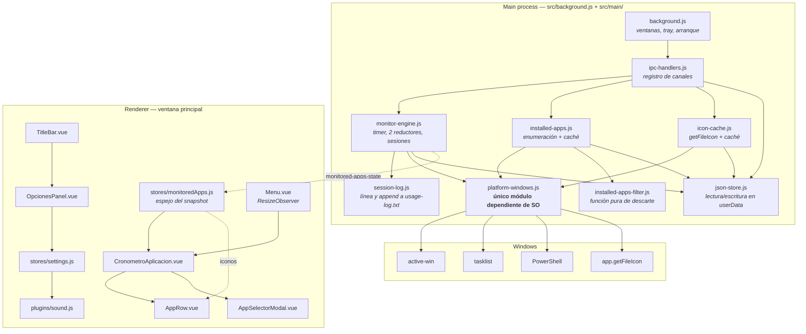
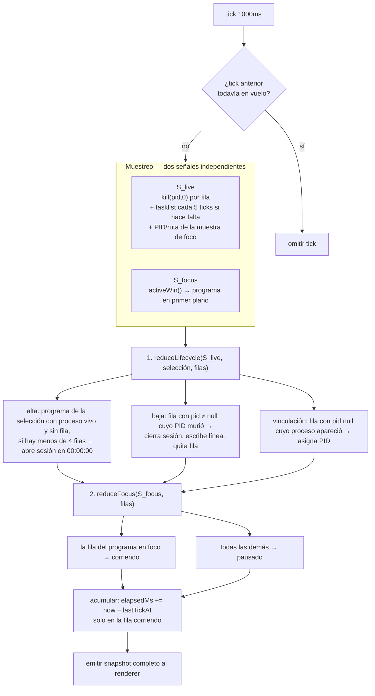
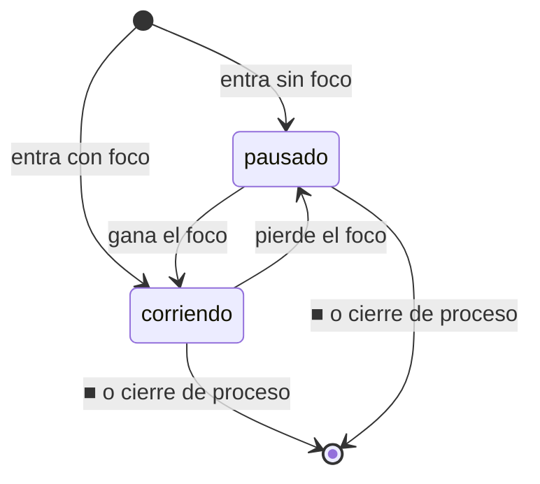
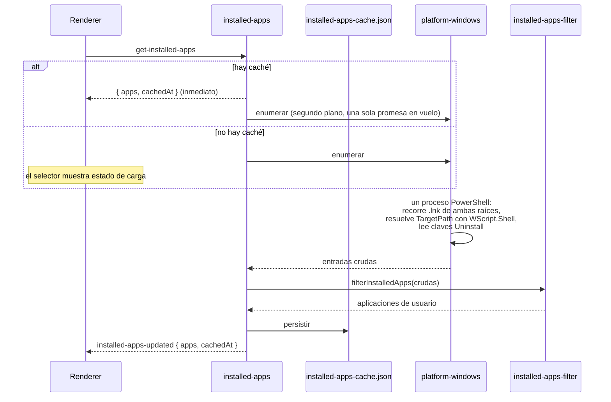

# Design: app-detection-logos-audio

## Principio rector

El cambio se ordena alrededor de una sola idea, la que las specs fijan y la que
`sdd-spec` marcó como riesgo si se viola:

> **El proceso vivo gobierna la existencia de la fila. El foco gobierna el estado de una
> fila viva.**

Cada señal observable produce un único efecto. Todo el diseño del motor —módulos, orden de
aplicación, contrato IPC, forma del dato— existe para que esa frontera sea difícil de
cruzar por accidente.

Las seis features se apoyan en tres capas:

1. **Motor de monitoreo en el main process** — decisiones D1 a D7. De él dependen
   `two-state-row-machine`, `row-lifecycle`, `saved-selection-only-monitoring`,
   `session-log-persistence` y `simultaneous-limit`.
2. **Superficies nuevas del main process** — decisiones D8 a D11: enumeración de instaladas,
   extracción de íconos, persistencia local.
3. **Renderer** — decisiones D12 a D17: store, UI de la fila, Opciones, volumen, resize y el
   fix del destello.

---

## Decisiones Técnicas

### D1. Motor con dos señales separadas sobre un único timer

**Contexto**: el motor actual evalúa un solo predicado por tick —`owner.name === appName`—
que mezcla "¿sigue abierto?" con "¿tiene el foco?". De esa fusión sale el bug de pausa.

**Decisión**: un `setInterval` de 1000ms en el main process muestrea dos señales
independientes, `S_live` y `S_focus`, y aplica dos reductores en orden fijo: primero
`reduceLifecycle` —que inserta y da de baja filas—, después `reduceFocus` —que asigna estado
a las filas que quedaron—. Ningún predicado combina las dos señales.

**Justificación**: es la forma más simple que cumple ambas specs sin estados intermedios, y
mantiene el costo de CPU del tick igual al actual en el caso común.

**ADR**: `[[0001-two-signal-monitoring-engine]]` — incluye las alternativas descartadas
(chequeo combinado, dos timers, eventos WMI).

---

### D2. El main process es la fuente de verdad; el renderer recibe un snapshot completo

**Contexto**: hoy el estado vive repartido entre main y renderer, con dos caminos de
escritura sobre las mismas variables del componente. Con cuatro filas y sesiones que se
cierran por eventos que solo el main observa, el reparto deja de ser viable.

**Decisión**: el main sostiene selección guardada, filas, estado, tiempo acumulado y
escritura al log. Empuja un snapshot completo del estado observable por un único canal, cada
tick y tras cada intención del usuario. El renderer aplica el snapshot con una mutación de
reemplazo y no deriva estado propio.

**Justificación**: elimina por construcción la divergencia entre los dos procesos, que es la
causa raíz del bug; las invariantes globales —una sola fila corriendo, cuatro filas como
máximo— se imponen en un solo lugar.

**Relación con `proposal.md`**: la propuesta esbozó extender el evento `app-active` con
`appName` y `pid`. El snapshot **subsume** ese esbozo y cumple su intención —que cada dato
sea atribuible a un programa concreto: el snapshot lleva `appId` y `pid` por fila— con un
mecanismo que además elimina la reconstrucción incremental del estado en el renderer, que es
justamente el mecanismo que hoy produce divergencia. El comportamiento observable por el
usuario es idéntico; cambia el transporte. El canal `app-active` desaparece.

**ADR**: `[[0002-main-process-owns-monitoring-state]]`.

---

### D3. Detección de proceso vivo: liveness barata por tick, descubrimiento condicional cada 5

**Contexto**: la señal `S_live` responde dos preguntas de costo muy distinto. Verificar que
un proceso conocido sigue vivo es barato; descubrir que un programa que no tenía fila acaba
de abrirse exige enumerar los procesos del sistema. `active-win` en Windows ya invoca un
binario por llamada, así que el tick actual no es gratis.

**Decisión**: la señal se muestrea por tres fuentes con cadencias distintas.

| Fuente | Cadencia | Costo | Qué aporta |
|---|---|---|---|
| `process.kill(pid, 0)` por fila con PID | cada tick | llamada de sistema, sin spawn | baja de filas cuyo proceso murió |
| muestra de `activeWin()` | cada tick | ya se paga para `S_focus` | evidencia de liveness del programa en foco |
| `tasklist /FO CSV /NH` | cada 5 ticks, condicionado | un spawn corto | alta de filas por apertura, y validación del par `(pid, imagen)` de cada fila |

La enumeración se ejecuta **solo si hace falta**: existe algún programa de la selección
guardada sin fila **y** el listado visible tiene menos de 4 filas. En el estado estacionario
—todos los programas de la selección con fila, o el listado lleno— no hay enumeración.

Un flag `inFlight` impide que dos ticks se solapen cuando el muestreo tarda más de un
segundo, cosa que el motor actual no contempla.

**Justificación**: separa el costo según la pregunta. La liveness, que se necesita cada
segundo para que la fila salga a tiempo, no cuesta nada. El descubrimiento, que tolera
latencia, se paga cada cinco segundos y solo cuando puede cambiar algo.

**Alternativas descartadas**:
- **PowerShell `Get-Process` para el descubrimiento**: es el mecanismo que el proyecto ya
  usa en `get-open-windows`, pero el arranque de PowerShell domina el costo. `tasklist` es
  un ejecutable del sistema que entrega nombre de imagen y PID —los dos datos que el
  descubrimiento necesita— con una fracción de ese costo. PowerShell se conserva donde sí
  aporta: ventanas abiertas con título y enumeración de instaladas.
- **Descubrir aperturas por foco** —un programa de la selección que gana el foco y no tiene
  fila la crea—: es tentador porque un programa recién abierto normalmente toma el foco.
  Se descarta porque hace del foco una fuente de existencia, que es exactamente el
  acoplamiento que el cambio elimina, y porque un programa que se abre en segundo plano
  nunca tendría fila.
- **Enumerar en cada tick sin la guarda**: simplifica el motor a costa de un spawn por
  segundo permanente.

**Riesgo aceptado**: una fila puede tardar hasta 5 segundos en aparecer tras abrirse el
programa, y esos segundos no se cuentan. La reutilización de PID de Windows puede sostener
viva una fila muerta durante ese mismo intervalo; la validación del par `(pid, imagen)` en
cada enumeración la corrige.

---

### D4. La identidad de un programa es la ruta de su ejecutable

**Contexto**: el código actual identifica el programa por el nombre que Windows reporta
—`"Google Chrome"`, `"CLIP STUDIO PAINT"`—, que es la descripción del ejecutable. Ese nombre
es el que hace falta que coincida con el archivo PNG de `src/assets/`, y es también el que se
compara en el motor. Es frágil: dos instalaciones pueden compartirlo, y no sirve para
extraer un ícono.

**Decisión**: `appId = exePath` normalizado a minúsculas. Es la clave única de la selección
guardada, de las filas, de la caché de íconos y de la correlación con procesos.

Reglas de correlación, en orden:

1. **Ruta**: `activeWin().owner.path` normalizado contra `appId`. Es la vía primaria y la
   única exacta.
2. **Nombre de imagen**: `basename(appId)` contra el nombre de imagen que devuelve
   `tasklist`. Es la vía del descubrimiento, porque `tasklist` no entrega ruta.

Una entrada elegida desde el listado de procesos abiertos cuya ruta no se pueda resolver
—procesos elevados, típicamente— usa como `appId` el prefijo `name:` más el nombre de imagen
en minúsculas, se correlaciona solo por nombre y muestra la imagen de respaldo. Es
degradación, no error.

`name` es un campo aparte: el nombre legible que se muestra en la fila, tomado del acceso
directo del Menú Inicio o de la descripción del proceso.

**Justificación**: una sola identidad para tres consumidores —motor, ícono, selección
persistida—, y es la única que soporta extraer el ícono de un programa cerrado.

**Alternativa descartada**: seguir identificando por nombre. Se descarta porque no permite
extraer íconos, porque no distingue instalaciones, y porque obligaría a mantener dos claves
—una para el motor y otra para el ícono— que hay que sincronizar.

---

### D5. Selección guardada y listado visible son dos formas de dato distintas

**Contexto**: `row-lifecycle` establece que son dos conjuntos distintos y que un programa
puede estar en la selección sin tener fila. Modelarlos con una sola estructura y un flag
reintroduce el enredo que el cambio elimina.

**Decisión**: dos formas separadas, con ciclos de vida y persistencia distintos.

**Entrada de selección guardada** — la intención del usuario, persistida:

```javascript
{
  appId:   'c:\\users\\x\\appdata\\local\\discord\\app-1.0.9\\discord.exe',
  name:    'Discord',
  exePath: 'C:\\Users\\X\\AppData\\Local\\Discord\\app-1.0.9\\Discord.exe',
  addedAt: 1754060000000
}
```

**Fila del listado visible** — estado en vivo, solo en memoria:

```javascript
{
  appId:            'c:\\…\\discord.exe',
  name:             'Discord',
  exePath:          'C:\\…\\Discord.exe',
  pid:              12345,        // null mientras no se observó proceso vivo
  state:            'running',    // 'running' | 'paused'
  elapsedMs:        84000,        // acumulado de la sesión en curso
  sessionStartedAt: 1754060000000,
  lastTickAt:       1754060084000 // interno del main, no viaja al renderer
}
```

Nada de la fila se persiste. La aplicación arranca sin filas y el motor las produce
observando el sistema.

**Justificación**: la separación de estructuras hace que la confusión entre ambos conjuntos
sea un error de tipo y no un error de lógica.

---

### D6. Una fila sin proceso observado espera; no sale del listado

**Contexto**: dos requisitos vigentes se tensionan. `row-lifecycle` exige que agregar un
programa a la selección lo muestre **de inmediato** como fila, sin condición. `proposal.md`
afirma que toda fila del listado tiene su proceso vivo. Si el usuario agrega desde el
selector de instaladas un programa que está cerrado, una lectura literal de ambos produce
una fila que aparece y que el reductor de ciclo de vida da de baja en el mismo tick,
escribiendo además una sesión de duración cero al historial.

**Decisión**: la baja de una fila requiere **transición observada de vivo a muerto**, no
ausencia de evidencia de vida. Formalmente: una fila sale del listado por cierre de proceso
solo si tiene `pid !== null` y ese PID dejó de estar vivo.

Consecuencia: una fila agregada manualmente mientras su programa está cerrado nace con
`pid: null` y estado `pausado`, y permanece así. Cuando el programa se abre, el
descubrimiento le asigna el PID —sin crear una fila nueva ni abrir una sesión nueva— y a
partir de ahí el foco la hace acumular. Cuando ese PID muere, la fila sale y la sesión se
registra con normalidad.

**Justificación**: satisface los dos requisitos a la vez sin modificar ninguna spec. La
afirmación de la propuesta sigue siendo cierta en su intención —ninguna fila queda congelada
con el proceso cerrado— porque describe filas que llegaron a tener proceso. La regla
resultante es además la única que evita escribir sesiones de duración cero por el solo hecho
de agregar un programa cerrado.

**Alternativa descartada**: que agregar un programa cerrado no cree fila. Contradice de
forma directa un criterio de aceptación de `row-lifecycle` —"Agregar un programa a la
selección lo muestra de inmediato como fila"— y el escenario de `empty-state` sobre agregar
desde el estado vacío.

**No requiere delta de spec**: ambas specs quedan satisfechas literalmente bajo esta regla.

---

### D7. El límite de 4 acota filas, no la selección guardada

**Contexto**: `simultaneous-limit` limita el **listado visible** a 4 filas e impide agregar
una quinta, tanto por agregado manual como por apertura de proceso. `row-lifecycle` no
limita la selección guardada.

**Decisión**: la selección guardada no tiene tope. El tope de 4 se impone en un único punto,
`reduceLifecycle`, que rechaza toda inserción cuando ya hay 4 filas, sin distinguir el
origen. Agregar a la selección siempre tiene éxito; la fila aparece si hay lugar, y aparece
sola más adelante cuando se libere.

Precedencia explícita: cuando `row-lifecycle` y `simultaneous-limit` chocan —agregar un
programa con el listado lleno—, gana el límite. `simultaneous-limit` cubre el caso manual de
forma expresa.

El snapshot lleva `limitReached`, con el que el renderer atenúa el `+` y el selector
comunica la situación, cumpliendo el SHOULD de la spec.

**Justificación**: un solo punto de imposición, imposible de eludir desde la UI.

---

### D8. Enumeración de aplicaciones instaladas

**Decisión**: fuente son los accesos directos `.lnk` del Menú Inicio de las dos raíces,
resueltos a ejecutable con `WScript.Shell` en un **único proceso PowerShell**; el registro
enriquece y marca descartes; el **filtrado vive en una función pura de JavaScript**; el
resultado se cachea en disco y se revalida en segundo plano en cada apertura del selector.

**ADR**: `[[0003-start-menu-installed-apps-enumeration]]` — con la tabla de descartes, el
sesgo hacia el falso negativo y las alternativas descartadas (registro como fuente, solo
procesos abiertos, un spawn por acceso directo, filtrado en PowerShell, caché con TTL).

**Contrato de la función pura** — es el criterio de aceptación de la feature hecho código:

```javascript
// src/main/installed-apps-filter.js
filterInstalledApps(rawEntries) → InstalledApp[]
// rawEntries: { shortcutName, shortcutFolder, targetPath, targetExists,
//               publisher, systemComponent, parentKeyName, releaseType }
// InstalledApp: { appId, name, exePath, publisher }
```

Sin dependencia de Electron ni del sistema operativo: se verifica con entradas fabricadas.

---

### D9. Íconos automáticos en blanco y negro

**Decisión**: `app.getFileIcon(exePath, { size: 'normal' })` en el main, serializado con
`toDataURL()`, cacheado por `exePath` en memoria y en disco, con `idk.png` de respaldo cuando
la imagen resulta vacía o la ruta no resuelve. El gris se aplica en el renderer con
`filter: grayscale(1)`. Los íconos viajan por un canal propio, fuera del snapshot.

La extracción funciona con el programa cerrado, que es la condición para que una entrada de
la selección guardada sin fila tenga ícono.

**ADR**: `[[0005-native-icon-extraction-css-grayscale]]`.

---

### D10. Aislamiento del código dependiente del sistema operativo

**Decisión**: todo el código que habla con Windows vive en `src/main/platform-windows.js`,
detrás de una interfaz definida por capacidades. Ningún otro archivo ejecuta PowerShell,
invoca binarios del sistema ni lee el registro. El filtrado del selector queda fuera del
módulo, por ser lógica de producto y no acceso al sistema.

**ADR**: `[[0004-os-dependent-code-single-module]]`.

---

### D11. Persistencia local

**Decisión**: JSON por concepto bajo `app.getPath('userData')`, leído y escrito solo por el
main, expuesto por IPC con el patrón que ya usa el Pomodoro. Cuatro archivos:
`monitored-selection.json`, `settings.json`, `installed-apps-cache.json`,
`app-icons-cache.json`. `usage-log.txt` conserva su formato; cambia quién escribe la línea,
que pasa del renderer al main.

**ADR**: `[[0006-userdata-json-persistence]]`.

---

### D12. Estructura de componentes del widget

**Contexto**: `.controls` es hoy un flex de 50px con `+` · ícono 32px · `.display` de `8ch` a
2rem · ■ · ▶, todo en un solo componente de 370 líneas que además contiene dos modales. El
diseño aprobado repite esa fila una vez por programa, sube el `+` al encabezado y convierte
el ▶ en indicador.

**Decisión**: cuatro componentes en vez de uno.

| Componente | Responsabilidad |
|---|---|
| `CronometroAplicacion.vue` | encabezado con historial, título y `+`; itera filas; estado vacío; sin lógica de conteo |
| `AppRow.vue` | una fila: logo, nombre, reloj, indicador, ■. Recibe la fila por prop, emite `stop` |
| `AppSelectorModal.vue` | selector con dos vías —instaladas y procesos abiertos—, buscador, marcado |
| `OpcionesPanel.vue` | pantalla de Opciones con los dos controles de volumen |

`AppRow.vue` es un componente de presentación: sin estado propio, sin temporizadores, sin
IPC. Recibe la fila y el ícono ya resueltos y emite una sola intención.

Estructura de la fila, respetando la geometría actual:

```
[logo 32px B/N] [nombre, ancho fijo, elipsis] [reloj 8ch 2rem][indicador ~12px]   [■ 18px]
└──────────────────── bloque de dato ────────────────────────────────────┘        └ acción ┘
```

El indicador queda pegado al reloj sin separación y el ■ al borde derecho con un gap
explícito, que es el movimiento que más trabaja para que el indicador no se lea como botón.
El indicador lleva `pointer-events: none`, `cursor: default`, sin hover ni `scale`, y
`aria-label` de estado —"Contando" / "En pausa"— sin verbo de acción, según
`status-indicator-non-interactive`.

Distinción de estados sin color de acento: `corriendo` a contraste pleno; `pausado` con
logo, nombre, reloj e indicador al ~55% de opacidad. El ■ mantiene contraste pleno en ambos,
porque su disponibilidad no depende del estado.

**Estado vacío**: sin filas, el widget muestra el `.display` en `00:00:00` en el lugar de la
fila y el `+` en el encabezado, sin mensaje ni ilustración — es el reposo actual de la app.

El `+` va en la esquina superior derecha del encabezado, con la misma regla absoluta que usa
`.button-history` cambiando `left` por `right`. Queda fijo mientras la lista crece hacia
abajo. Con `limitReached` se atenúa y deja de responder.

**Justificación**: separar `AppRow` de su contenedor es lo que permite que la fila sea
puramente declarativa sobre el snapshot; mientras la fila conserve estado propio, vuelve a
existir la posibilidad de que divergir del main.

**Alternativa descartada**: renderizar N instancias de `CronometroAplicacion.vue`, una por
programa, como evaluó `sdd-explore`. Se descarta porque cada instancia arrastraría su propio
temporizador y su propio estado —el patrón que el cambio elimina— y porque el encabezado con
el `+`, el estado vacío y el límite son propiedades del conjunto, no de una fila.

---

### D13. El redimensionado de la ventana reacciona al alto, no a la interacción

**Contexto**: `Menu.vue` mide `scrollHeight`/`scrollWidth` de `#menuContainer` y llama
`setContentSize`, hoy desde dos copias del mismo bloque —`aplicarSeleccion()` y
`resizeWindow()`— disparadas por gestos del usuario. En el modelo nuevo las filas entran y
salen **solas** cuando los programas se abren y se cierran, así que el disparo por gesto no
alcanza: existe una causa de cambio de alto que ningún gesto acompaña.

**Decisión**: `Menu.vue` observa `#menuContainer` con un `ResizeObserver` y recalcula el
tamaño de la ventana ante cualquier cambio de alto, venga de donde venga —aplicar selección,
arrastrar widgets, entrada o salida de fila, paso al estado vacío—. Las dos copias actuales
se reducen a una sola llamada a `resizeWindow()`.

Dos guardas, ambas necesarias:

- **Antibucle**: `setContentSize` modifica el layout y puede reactivar al observador. El
  recálculo se agenda en `requestAnimationFrame` y solo llama a `setContentSize` cuando el
  tamaño calculado difiere del último aplicado en más de 1px.
- **Desmontaje**: el observador se desconecta en `beforeUnmount`.

El alto queda acotado por diseño: fila de 50px fijos y máximo 4 filas.

**Justificación**: una sola vía de redimensionado para todas las causas, presentes y
futuras. La alternativa —que el widget emita un evento hacia `Menu.vue` en cada entrada y
salida de fila— obliga a enumerar cada causa y falla en silencio la primera vez que alguien
agrega una y olvida el emit; justamente el caso de la salida por cierre de proceso, que no
tiene gesto que lo recuerde.

**Riesgo aceptado**: el bucle de realimentación es real y las guardas son la única
protección. Es punto explícito del guion de verificación manual.

---

### D14. Opciones como modal de la ventana principal, desde `TitleBar.vue`

**Contexto**: no existe pantalla de Opciones. `dual-volume-control` pide una accesible desde
la barra de la aplicación. `TitleBar.vue` ya importa `faGear` sin usarlo y ya renderiza un
modal con las clases `.modal-overlay` / `.modal-content` como hermano de la barra.

**Decisión**: un botón `faGear` en `.window-controls` abre `OpcionesPanel.vue` como modal
superpuesto en la ventana principal, reutilizando el patrón de modal que el componente ya
tiene.

**Justificación**: no agrega una entrada al `pages` de `vue.config.js`, no agrega ciclo de
vida de ventana, no interactúa con `resizeWindow()`, y la barra es visible en todas las
vistas, que es lo que pide el escenario de acceso de la spec.

**Alternativas descartadas**:
- **Ventana `BrowserWindow` propia**, como el historial: exigiría una tercera entrada de
  webpack, su propio arranque y su propio manejo de fondo oscuro —el mismo destello que este
  cambio corrige en otro lado— para un panel de dos deslizadores.
- **Un cuarto widget en `Menu.vue`**: Opciones no es un cronómetro; entraría en la lista
  arrastrable y en el `scroll-snap` junto a Manual, Aplicación y Pomodoro.

---

### D15. Volumen: maestro global multiplicado por volumen de instancia

**Contexto**: `src/plugins/sound.js` crea cinco `Howl` y expone `$playSound(key)` sin
volumen. La spec pide un maestro que afecte todo, incluida la alarma, y un control de
interacción que afecte los cuatro sonidos decorativos sin tocar la alarma, con el efectivo de
interacción calculado **en relación** al maestro.

**Decisión**: se apoya en que `Howler.volume()` es global **relativo al volumen propio de
cada sonido**, es decir multiplicativo.

| Control | Mecanismo | Efectivo |
|---|---|---|
| maestro | `Howler.volume(master)` | aplica a los cinco |
| interacción | `howl.volume(interaction)` sobre `add`, `popUp`, `pressButton`, `deleteItem` | `master × interaction` |
| alarma | `endSession` conserva `volume(1)` | `master × 1` |

El plugin exporta `setMasterVolume(v)` y `setInteractionVolume(v)` además de instalar
`$playSound`. Los valores se cargan de `settings.json` al arrancar el renderer y se aplican
antes del primer sonido.

**Justificación**: la semántica de la spec —"calcular el volumen efectivo de cada sonido de
interacción en relación al control maestro"— es literalmente la multiplicación que howler ya
hace. Sin aritmética propia ni volumen recalculado en cada reproducción.

**Alternativa descartada**: calcular `master × interaction` a mano y aplicarlo con
`howl.volume()` en cada `play()`. Duplica lógica que la librería ya provee y hay que
recordar aplicarla en cada punto de reproducción.

---

### D16. Fix del destello blanco al abrir el historial

**Contexto**: `open-history-window` crea la `BrowserWindow` sin `backgroundColor` y sin
`show: false`, así que se muestra de inmediato con el blanco por defecto de Chromium; el
fondo `#1b1b1b` llega recién cuando el bundle ejecuta el `<style>` no-scoped de
`HistoryView.vue`. La `mainWindow` no tiene el problema porque ya usa ambas opciones.

**Decisión**: las tres capas que la documentación de Electron recomienda combinar.

1. `backgroundColor: '#1b1b1b'` en las opciones de la `BrowserWindow` del historial — el
   primer pixel ya es oscuro.
2. `show: false` más `historyWindow.once('ready-to-show', () => historyWindow.show())` — la
   ventana no se expone hasta que hay un primer pintado.
3. `background-color: #1b1b1b` en `<style>` dentro del `<head>` de `public/history.html` —
   el fondo está en el HTML servido, sin esperar al bundle.

**Justificación**: es el patrón documentado y el que la propia `mainWindow` ya aplica. Las
tres capas cubren momentos distintos —creación de ventana, primer pintado, carga del
bundle— y ninguna sustituye a las otras.

---

### D17. Store nuevo para apps monitoreadas, sin tocar `menu.js`

**Contexto**: `src/stores/menu.js` modela qué widgets están activos con tres booleanos y un
getter. No tiene relación con qué programas se monitorean.

**Decisión**: dos stores nuevos, `monitoredApps` y `settings`, sin modificar `menu.js`. Los
tres ejes de estado quedan separados: qué widgets se ven (`menu`), qué programas se
monitorean (`monitoredApps`), qué preferencias tiene el usuario (`settings`).

`monitoredApps` es **espejo, no modelo**: su estado se reemplaza entero al recibir el
snapshot, y sus actions solo envían intenciones por IPC. La única excepción es `icons`, un
mapa local `exePath → dataUrl` que el store llena bajo demanda.

**Justificación**: extender `menu.js` mezclaría el estado de presentación del menú con el
del dominio, y su getter `selected` no tiene nada que ver con la selección guardada de
programas pese a la coincidencia de nombre. Mantenerlos separados evita esa confusión.

---

## Arquitectura

### Vista de componentes



### El tick del motor



El orden importa. Con el ciclo de vida primero, una fila que entra recibe su estado de la
misma muestra de foco del tick, y una fila que sale nunca recibe estado.

### Estado de una fila viva



Dos estados, cuatro transiciones internas y dos salidas. Las entradas y las salidas
pertenecen al ciclo de vida, no a la máquina de estados: no hay estado "detenido" ni
"cerrado".

### Salida de fila: los dos eventos son el mismo camino

```mermaid
sequenceDiagram
  participant U as Usuario
  participant R as Renderer
  participant E as monitor-engine
  participant S as session-log
  participant W as Windows

  Note over U,W: Camino A — el usuario presiona ■
  U->>R: click en ■
  R->>E: stop-monitored-row(appId)
  E->>E: closeRow(appId, 'user-stop')

  Note over U,W: Camino B — el proceso se cierra
  W-->>E: kill(pid,0) falla en el tick
  E->>E: closeRow(appId, 'process-exit')

  Note over E,S: A partir de acá, un único procedimiento
  E->>S: appendSession(fila)
  S->>S: línea con formato actual → usage-log.txt
  E->>E: quitar fila del listado
  E->>R: snapshot (sin la fila; el programa sigue en la selección)
  R->>R: la lista se reacomoda y ResizeObserver ajusta la ventana
```

Los dos eventos convergen en `closeRow`. Un único procedimiento es lo que garantiza el
requisito de `row-lifecycle` de que ambos tengan efectos observables idénticos: no hay dos
implementaciones que puedan divergir.

### Selector de instaladas: caché revalidada



---

## Contratos de Componentes

### Canales IPC

Convención de nombres: kebab-case plano, la que ya usan `get-open-windows`,
`save-log-line`, `load-sessions`.

**Renderer → Main, con respuesta (`invoke` / `ipcMain.handle`)**

| Canal | Argumento | Respuesta |
|---|---|---|
| `get-monitored-snapshot` | — | `Snapshot` |
| `add-to-selection` | `{ appId, name, exePath }` | `Snapshot` |
| `remove-from-selection` | `appId` | `Snapshot` |
| `get-installed-apps` | — | `{ apps: InstalledApp[], cachedAt: number\|null, loading: boolean }` |
| `get-open-windows` | — | `OpenWindow[]` — **existente, extendido** |
| `get-app-icon` | `exePath` | `{ exePath, dataUrl }` — `dataUrl` es el respaldo si no hay ícono útil |
| `get-settings` | — | `{ masterVolume, interactionVolume }` |
| `get-app-logs` | — | sin cambios |

**Renderer → Main, sin respuesta (`send` / `ipcMain.on`)**

| Canal | Argumento | Efecto |
|---|---|---|
| `stop-monitored-row` | `appId` | cierra sesión, escribe línea, quita fila, emite snapshot |
| `save-settings` | `{ masterVolume, interactionVolume }` | persiste en `settings.json` |

**Main → Renderer (`webContents.send`)**

| Canal | Payload | Cuándo |
|---|---|---|
| `monitored-apps-state` | `Snapshot` | cada tick y tras cada intención del usuario |
| `installed-apps-updated` | `{ apps, cachedAt }` | al terminar una revalidación en segundo plano |

**Canales que desaparecen**: `start-cronometro-monitoring`, `stop-cronometro-monitoring`,
`app-active` y `save-log-line`. Los tres primeros los reemplaza el snapshot; el cuarto pasa a
ser una llamada interna del main, porque la sesión ahora vive de ese lado. Ninguno tiene
consumidores fuera de `CronometroAplicacion.vue`.

**Canales que no se tocan**: `start-monitoring-active-window`,
`stop-monitoring-active-window`, `set-always-on-top`, `open-history-window`, `get-app-logs`,
`load-sessions`, `save-sessions`.

### Formas de dato

```javascript
// Snapshot — main → renderer, mensaje único de estado
{
  rows: [{
    appId:            String,   // exePath normalizado, o 'name:<imagen>' si no hay ruta
    name:             String,   // nombre legible que se muestra
    exePath:          String|null,
    pid:              Number|null,
    state:            'running' | 'paused',
    elapsedMs:        Number,   // acumulado de la sesión en curso
    sessionStartedAt: Number    // epoch ms
  }],
  selection: [{ appId, name, exePath }],   // sin tope
  limitReached: Boolean                    // rows.length === 4
}

// InstalledApp — salida de la función pura de filtrado
{ appId: String, name: String, exePath: String, publisher: String|null }

// OpenWindow — get-open-windows, extendido sin romper a TitleBar.vue
{ appName: String,      // se conserva: TitleBar.vue lo consume y queda intacto
  exePath: String|null, // agregado
  pid:     Number }     // agregado
```

`appName` se conserva en `OpenWindow` de forma deliberada: `TitleBar.vue` usa ese campo para
el pin sobre una app y queda fuera del alcance del cambio, así que la extensión es aditiva.

### Interfaz del módulo de plataforma

```javascript
// src/main/platform-windows.js — único módulo dependiente de SO
getForegroundWindow()      → Promise<{ exePath, name, pid } | null>
listRunningProcesses()     → Promise<[{ imageName, pid }]>
isProcessAlive(pid)        → Boolean                       // sin spawn
listOpenWindows()          → Promise<OpenWindow[]>
listInstalledCandidates()  → Promise<RawInstalledEntry[]>  // sin filtrar
getExecutableIcon(exePath) → Promise<String|null>          // data URL
```

`RawInstalledEntry`: `{ shortcutName, shortcutFolder, targetPath, targetExists, publisher,
systemComponent, parentKeyName, releaseType }`.

### Store del renderer

```javascript
// src/stores/monitoredApps.js
state:   { rows: [], selection: [], limitReached: false, icons: {} }
actions: applySnapshot(payload)   // reemplazo completo, única mutación de estado del motor
         addApp({ appId, name, exePath })
         removeApp(appId)
         stopRow(appId)
         ensureIcon(exePath)      // pide el ícono si falta y lo cachea en `icons`

// src/stores/settings.js
state:   { masterVolume: 1, interactionVolume: 1 }
actions: load()                   // get-settings → aplica a sound.js
         setMaster(v) / setInteraction(v)   // aplica y persiste
```

### Funciones puras extraídas

Cumplen la mitigación declarada en la propuesta —lógica testeable aunque el runner llegue
después— y ninguna depende de Electron ni del sistema operativo.

| Función | Módulo |
|---|---|
| `msToHHMMSS`, `formatTimeHHMMSS`, `formatDateYYYYMMDD` | `src/utils/time-format.js` |
| `filterInstalledApps(rawEntries)` | `src/main/installed-apps-filter.js` |
| `buildSessionLine(row, endDate)` | `src/main/session-log.js` |
| `reduceLifecycle(...)`, `reduceFocus(...)` | `src/main/monitor-engine.js` |

`time-format.js` lo consumen los dos procesos: el main para la línea del log, el renderer
para el reloj de la fila. Hoy ese formateo está duplicado en `CronometroAplicacion.vue` y en
`HistoryView.vue`.

---

## Estrategia de Testing

El proyecto no tiene runner ni CI, y el cambio no los agrega. La verificación tiene dos
patas.

### Lógica pura aislada, lista para un runner

Las cuatro funciones de la tabla anterior no dependen de Electron ni de Windows y se ejercen
con entradas fabricadas. Los casos que un runner futuro cubre primero:

- `reduceLifecycle`: alta por apertura, alta por agregado manual con proceso cerrado, baja
  por muerte de PID, no-baja de fila con `pid: null`, rechazo de la quinta fila, vinculación
  de PID sin abrir sesión nueva, indiferencia total ante programas fuera de la selección.
- `reduceFocus`: como máximo una fila `corriendo`; foco en un programa sin fila deja todas en
  `pausado`; el foco no altera la cantidad de filas.
- `filterInstalledApps`: Discord y Clip Studio pasan; actualizador, redistribuible con
  `SystemComponent = 1`, target bajo `\Windows\`, target inexistente y entrada `KB######` se
  descartan.
- `buildSessionLine`: la línea generada matchea la expresión regular de `get-app-logs`.

### Guion de verificación manual

`sdd-verify` lo ejecuta sobre un build de Windows. Cada punto corresponde a un criterio de
aceptación.

**Motor** — verificable con un solo programa antes de sumar UI:

1. Abrir un programa de la selección → aparece su fila, reloj en `00:00:00`.
2. Poner el foco en él → el reloj avanza, indicador en play.
3. Cambiar el foco a otra ventana → el reloj se detiene, la fila **sigue visible** en pausa,
   nada se escribe al historial.
4. Volver el foco → el reloj retoma desde donde estaba.
5. Cerrar el programa → la fila desaparece y aparece una línea en el historial.
6. Reabrirlo → fila nueva, reloj en `00:00:00`, línea anterior intacta.
7. Poner el foco en un programa que **no** está en la selección → nada cambia: ni fila, ni
   conteo, ni línea.

**Multi-fila y límite**:

8. Con cuatro programas abiertos, alternar el foco → como máximo un reloj avanza a la vez.
9. Con cuatro filas, abrir un quinto programa de la selección → no aparece quinta fila.
10. Presionar ■ en una → la fila sale, se escribe su línea, el programa sigue en la
    selección, y el quinto entra.
11. Cerrar el proceso de otra → efecto idéntico al del ■ en todo lo observable.
12. Sacar la última fila → el widget queda en `00:00:00` con el `+`, sin mensaje.

**Ventana**: 13. Repetir entradas y salidas de fila sin tocar el mouse y observar que la
ventana se ajusta cada vez, sin saltos ni oscilación —comprobación del antibucle del
`ResizeObserver`.

**Íconos**: 14. Cada fila muestra el ícono real del programa en gris. 15. Un programa sin
ícono útil muestra `idk.png`. 16. Reabrir la app: los íconos aparecen sin reextraer.

**Selector**: 17. Con Discord y Clip Studio instalados, ambos figuran. 18. Recorrer el
listado completo sin encontrar runtimes, actualizadores, redistribuibles ni servicios.
19. Filtrar por texto acota. 20. La segunda vía por procesos abiertos permite elegir un
programa portable.

**Indicador**: 21. Click sobre ▶/⏸ no produce nada. 22. El cursor no cambia y no hay
resalte al pasar por encima.

**Volumen**: 23. Maestro a cero silencia todo, incluida la alarma de fin de sesión.
24. Interacción a cero silencia clics y deja la alarma audible. 25. Ambos valores sobreviven
al reinicio de la aplicación.

**Historial**: 26. Abrir la ventana de historial no produce destello blanco en ningún
momento.

---

## Output Expected

### Archivos a crear

| Archivo | Qué hace |
|---|---|
| `src/main/platform-windows.js` | Único módulo dependiente de SO. Foco vía `active-win`; enumeración de procesos vía `tasklist`; liveness vía `process.kill(pid,0)`; ventanas abiertas y enumeración de instaladas vía PowerShell; ícono vía `app.getFileIcon` + `toDataURL()`. Expone la interfaz de seis capacidades de D10. |
| `src/main/monitor-engine.js` | Timer único de 1000ms con guarda `inFlight`; muestreo de las dos señales; `reduceLifecycle` y `reduceFocus` como funciones puras exportadas; acumulación por reloj de pared; `closeRow(appId, motivo)` como único camino de salida; construcción y emisión del snapshot; arranque y parada del timer según la selección guardada esté o no vacía. |
| `src/main/session-log.js` | `buildSessionLine(row, endDate)` con el formato actual de `usage-log.txt` y el append al archivo. Absorbe la lógica que hoy vive en `CronometroAplicacion.reset()`. |
| `src/main/installed-apps.js` | Orquesta la enumeración: caché en disco, revalidación en segundo plano, deduplicación de la promesa en vuelo, llamada al módulo de plataforma y al filtro puro, emisión de `installed-apps-updated`. |
| `src/main/installed-apps-filter.js` | `filterInstalledApps(rawEntries)`. Función pura con la tabla de descartes completa del ADR-0003. Sin dependencias de Electron ni de Windows. |
| `src/main/icon-cache.js` | Caché de dos niveles por `exePath` normalizado; extracción bajo demanda; respaldo cuando la imagen resulta vacía o la ruta no resuelve. |
| `src/main/json-store.js` | `readJson(file, fallback)` / `writeJson(file, data)` bajo `app.getPath('userData')`, con lectura tolerante a archivo ausente y JSON corrupto. |
| `src/main/ipc-handlers.js` | Registro de todos los canales de la tabla de contratos, en un solo lugar. Invocado desde `background.js`. |
| `src/utils/time-format.js` | `msToHHMMSS`, `formatTimeHHMMSS`, `formatDateYYYYMMDD`. Consumido por los dos procesos. |
| `src/stores/monitoredApps.js` | Store Pinia espejo del snapshot, con `applySnapshot`, las actions de intención y el mapa local de íconos. Suscripción a `monitored-apps-state`. |
| `src/stores/settings.js` | Store Pinia de volúmenes; carga inicial desde `get-settings`, persistencia por `save-settings`, aplicación sobre `sound.js`. |
| `src/components/AppRow.vue` | Fila de presentación pura: logo 32px en gris, nombre de ancho fijo con elipsis, reloj `8ch`, indicador no interactivo pegado al reloj, ■ al borde derecho. Prop de fila, emit `stop`. Atenuación al ~55% en estado pausado. |
| `src/components/AppSelectorModal.vue` | Selector con las dos vías —instaladas y procesos abiertos—, buscador por texto, marcado de la selección guardada, estado de carga, aviso de límite alcanzado. Reemplaza el modal actual del widget. |
| `src/components/OpcionesPanel.vue` | Panel de Opciones con los dos deslizadores de volumen, sobre el patrón de modal que `TitleBar.vue` ya usa. |

### Archivos a modificar

| Archivo | Qué cambia |
|---|---|
| `src/background.js` | Queda como arranque: ventanas, tray, atajos, protocolo. Se le quitan `start-cronometro-monitoring`, `stop-cronometro-monitoring`, `save-log-line`, la variable `cronometroInterval`, `currentAppName` y el `setInterval` de detección. Delega el registro de canales en `ipc-handlers.js`. En `open-history-window` agrega `backgroundColor: '#1b1b1b'`, `show: false` y `once('ready-to-show')`. Conserva sin cambios `start-monitoring-active-window`, `stop-monitoring-active-window`, `set-always-on-top`, `get-app-logs`, `load-sessions` y `save-sessions`. |
| `src/components/CronometroAplicacion.vue` | Reescritura. Deja de tener `time`, `intervalId`, `running`, `startTime`, `selectedApp`, el `watch` que resuelve el ícono con `require('@/assets/…')`, los métodos `toggle`/`start`/`pause`/`reset`/`resumeTime`/`pauseTime`, el listener `app-active` y los formateadores. Pasa a leer el store y renderizar: encabezado con historial, título y `+` en la esquina superior derecha; `v-for` de `AppRow`; estado vacío con `00:00:00`; `AppSelectorModal`. El modal de historial por fecha que hoy contiene se conserva tal cual. |
| `src/components/Menu.vue` | `resizeWindow()` pasa a ser la única implementación —`aplicarSeleccion()` deja de duplicarla y la llama—; se agrega el `ResizeObserver` sobre `#menuContainer` con agendado en `requestAnimationFrame`, guarda de diferencia mayor a 1px y desconexión en `beforeUnmount`. |
| `src/components/TitleBar.vue` | Se agrega el botón `faGear` en `.window-controls` —el ícono ya está importado y sin uso— y el montaje de `OpcionesPanel`. El modal de pin sobre una app y su `selectApp` quedan intactos. |
| `src/plugins/sound.js` | Exporta `setMasterVolume(v)` y `setInteractionVolume(v)` además de instalar `$playSound`. `setMasterVolume` llama `Howler.volume(v)`; `setInteractionVolume` aplica `howl.volume(v)` a `add`, `popUp`, `pressButton` y `deleteItem`. `endSession` conserva volumen 1. |
| `public/history.html` | `<style>` en el `<head>` con `html, body { background-color: #1b1b1b; margin: 0; }`. |
| `src/main.js` | Carga inicial del store de settings antes del primer render, para que el volumen persistido rija desde el primer sonido. |

### Archivos que no se tocan

`src/stores/menu.js`, `src/components/CronometroManual.vue`,
`src/components/CronometroPomodoro.vue`, `src/history/HistoryView.vue`,
`src/history/main.js`, `src/utils/stateManager.js`, `forge.config.js`, `vue.config.js`,
`package.json`. Los assets PNG por nombre de programa quedan en su lugar; solo `idk.png`
sigue teniendo consumidor, como imagen de respaldo.

### Orden de implementación sugerido

Sigue la secuencia aprobada en la propuesta, que aísla el refactor más riesgoso para poder
verificarlo solo antes de montarle features encima.

1. **Independientes** — destello del historial (D16) y Opciones con volumen (D14, D15, más
   `settings.json`). No tocan el motor.
2. **Motor** — `platform-windows.js`, `json-store.js`, `session-log.js`,
   `monitor-engine.js`, `ipc-handlers.js`, `time-format.js` y la poda de `background.js`.
   Se verifica con **un solo programa monitoreado**, con los puntos 1 a 7 del guion manual.
3. **Store y UI multi-programa** — `monitoredApps.js`, `AppRow.vue`, reescritura de
   `CronometroAplicacion.vue`, `ResizeObserver` en `Menu.vue`. Puntos 8 a 13 y 21 a 22.
4. **Íconos** — `icon-cache.js` y el canal `get-app-icon`, con el modelo por app ya en pie.
   Puntos 14 a 16.
5. **Selector de instaladas** — `installed-apps.js`, `installed-apps-filter.js`,
   `AppSelectorModal.vue`. Puntos 17 a 20.

---

## Riesgos del diseño

| Riesgo | Mitigación en el diseño |
|---|---|
| Alguien vuelve a fusionar las dos señales en un chequeo único y reintroduce el bug | Reductores separados en funciones distintas, con ADR-0001 como registro de por qué |
| Bucle de realimentación entre `ResizeObserver` y `setContentSize` | Agendado en `requestAnimationFrame`, guarda de diferencia mayor a 1px, punto 13 del guion manual |
| `activeWin().owner.processId` no está confirmado por uso en este repositorio | La ruta del ejecutable es la clave primaria de correlación; el PID de la muestra de foco es refuerzo, no requisito. `sdd-apply` verifica el campo en la primera ejecución |
| Reutilización de PID de Windows sostiene viva una fila muerta | Validación del par `(pid, nombre de imagen)` en cada enumeración, cada 5 segundos |
| Un ■ inmediato tras agregar un programa escribe una sesión de duración `00:00:00` | Comportamiento literal de `session-log-persistence`, que registra en los dos eventos de salida sin excepción. El historial agrega por día y una línea en cero no altera el total |
| Latencia de hasta 5 segundos entre abrir un programa y ver su fila | Aceptada en ADR-0001; el ahorro es el 100% de la pieza más cara del tick en estado estacionario |
| El refactor del motor no tiene red de tests | Lógica pura extraída y verificable, y guion manual por transición ejecutado al cierre de la fase 2, antes de sumar UI |
