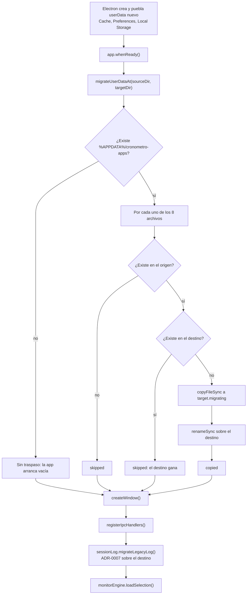

# Diseño técnico — open-source-readiness

## Alcance de este documento

El núcleo es el **algoritmo del traspaso de `userData`** (D-1 a D-6): código nuevo en el main
process que opera sobre datos irreemplazables de una base instalada real. El resto —identidad,
build, lint y CI— se documenta al nivel de decisión y de archivo afectado (D-7 a D-14), con las
trampas verificadas que `sdd-apply` necesita para no romper nada.

Todo lo que este documento afirma sobre el comportamiento de las herramientas está verificado
contra el código realmente instalado en `node_modules/` de este proyecto, no contra
documentación: las versiones están fijadas por `package-lock.json` (lockfileVersion 3), así que
ese código es la fuente autoritativa. Ver `tech-context.md` para el detalle.

---

## Parte A — Traspaso de `userData` (núcleo)

### D-1. Un módulo propio, libre de `electron`, con las rutas por parámetro

El traspaso vive en **`src/main/userdata-migration.js`**, que solo usa `fs` y `path` del núcleo
de Node. Las rutas reales llegan como parámetro; el módulo nunca llama a `app.getPath()`.

Superficie pública:

| Export | Forma | Rol |
|---|---|---|
| `LEGACY_USERDATA_DIRNAME` | `'cronometro-apps'` | nombre del directorio de la identidad anterior |
| `OWNED_FILES` | array de 8 strings | los archivos que la aplicación posee bajo `userData` |
| `migrateUserDataAt({ sourceDir, targetDir })` | `{ copied, skipped, failed }` | el traspaso completo |

**Por qué así.** Es el mismo desdoblamiento que el proyecto ya aplicó en ADR-0007:
`session-log-parser.js` no importa `electron` y recibe `{ sessionsPath, legacyPath, backupPath }`,
mientras que `session-log.js` resuelve `app.getPath('userData')` y delega. El comentario de
cabecera de `session-log-parser.js:1-10` declara el motivo: un módulo que hace
`require('electron')` en su nivel superior es imposible de ejercitar con `node -e` en un entorno
sin `node_modules`. Ese motivo es acá **la única verificación local disponible** (D-13): en WSL2
no se puede compilar ni ejecutar la aplicación.

La resolución de rutas queda en el llamador (`src/background.js`), que ya importa `app` y `path`
(líneas 3 y 8): son cuatro líneas, y evita un tercer archivo intermedio para 40 líneas de lógica.

**Sobre ADR-0004** (todo el código dependiente del SO vive en `platform-windows.js`): este módulo
**no** es código dependiente del SO. No ejecuta PowerShell, `tasklist` ni registro de Windows; el
`%APPDATA%` lo resuelve Electron con `app.getPath('appData')`, que es multiplataforma, y el
nombre del directorio legado no depende del sistema. Por eso no pertenece a
`platform-windows.js` y ADR-0004 no se ve afectado.

### D-2. La condición es por archivo, y la lista de archivos es cerrada

Se traspasan exactamente estos ocho archivos, **cada uno solo si no existe en el destino**:

| Archivo | Dueño en el código | Contenido |
|---|---|---|
| `sessions.json` | `src/main/session-log.js:21` | historial estructurado (ADR-0007) |
| `usage-log.txt` | `src/main/session-log.js:25` | historial legado en texto plano |
| `usage-log.txt.bak` | `src/main/session-log.js:29` | respaldo del historial legado |
| `settings.json` | `src/main/ipc-handlers.js:15` | preferencias: volúmenes y formato de hora |
| `monitored-selection.json` | `src/main/monitor-engine.js:451` | selección guardada de programas |
| `installed-apps-cache.json` | `src/main/installed-apps.js:29` | caché del listado de instaladas |
| `app-icons-cache.json` | `src/main/icon-cache.js:93` | caché de íconos por ruta de ejecutable |
| `pomodoro-sessions.json` | `src/background.js:212` | sesiones del pomodoro |

**Lista verificada contra el código del worktree**, no heredada de la propuesta: el barrido de
todos los literales `*.json`/`*.txt` de `src/` y de todos los usos de `app.getPath('userData')`
devuelve exactamente estos ocho y ninguno más. La lista de la propuesta es correcta: no falta ni
sobra ninguno.

Un noveno literal aparece en el barrido y **queda fuera a propósito**: `state.txt` de
`src/utils/stateManager.js:6` se escribe con `path.join(__dirname, ...)`, es decir **junto al
propio módulo dentro del bundle empaquetado, no bajo `userData`**, y no tiene ninguna referencia
en el resto del código. ADR-0006 ya lo declaró deuda fuera de alcance; sigue estándolo.

**Por qué la condición no puede ser por directorio.** La traducción literal del paso 1 de
ADR-0007 —"si el destino ya existe, no migrar"— nunca dispararía: Electron crea y puebla el
`userData` nuevo con estado propio de Chromium (`Cache/`, `Preferences`, `Local Storage/`) antes
de `whenReady`, así que el directorio destino **siempre** existe cuando la aplicación toma el
control. La condición por archivo conserva las tres propiedades del ADR-0007 —one-shot,
idempotente, no destructiva— y define por construcción el caso de ambos directorios poblados:
**el destino gana, archivo por archivo, sin fusión ni sobreescritura**.

El estado de Chromium no se copia. Es estado de otra identidad de aplicación, regenerable, y
copiarlo no aporta nada al usuario.

### D-3. Copia atómica por archivo: `copyFileSync` a temporal + `renameSync`

Cada archivo se publica en el destino por renombre, igual que `writeJsonAtomic`
(`src/main/json-store.js:35-39`) y que la migración de ADR-0007
(`src/main/session-log-parser.js:101-103`):

```
tmp = target + '.migrating'
fs.copyFileSync(source, tmp)
fs.renameSync(tmp, target)
```

El archivo destino **solo aparece cuando ya está completo**: no existe ningún instante en que un
lector vea un `sessions.json` a medio copiar. Eso satisface el requirement de la spec sobre
interrupción a mitad de camino sin ninguna maquinaria extra.

El sufijo es `.migrating` y no `.tmp` para no colisionar conceptualmente con los `.tmp` que
`writeJsonAtomic` y `migrateLegacyLogAt` ya usan sobre los mismos nombres de archivo.

**No hace falta limpiar temporales.** Un `.migrating` sobreviviente solo puede existir si el
proceso murió entre el `copyFileSync` y el `renameSync`; en ese caso el destino sigue ausente, el
arranque siguiente vuelve a copiar sobre el mismo temporal (`copyFileSync` trunca) y lo renombra,
que es lo que lo elimina. El estado se autolimpia sin código dedicado.

### D-4. Punto de invocación: primera sentencia de `app.whenReady()`

En `src/background.js`, el traspaso corre como **primera sentencia del callback de
`app.whenReady().then(...)`** (hoy línea 134), antes de `createTray()` y de `createWindow()`:

```js
const userDataMigration = require('./main/userdata-migration.js')
// ...
app.whenReady().then(async () => {
  userDataMigration.migrateUserDataAt({
    sourceDir: path.join(app.getPath('appData'), userDataMigration.LEGACY_USERDATA_DIRNAME),
    targetDir: app.getPath('userData'),
  })
  // … resto del arranque existente
```

**Por qué ahí y no dentro de `createWindow()`**: `createWindow()` es reentrante —lo llaman
`whenReady`, `showMainWindow()` y el handler de `activate`— así que el traspaso correría más de
una vez por proceso; sería inocuo por idempotencia, pero es trabajo repetido sin motivo.
`whenReady` corre una sola vez.

**Por qué ahí alcanza**: ninguna lectura de los ocho archivos ocurre antes. Verificado módulo por
módulo: todos resuelven su ruta dentro de una función (`getSettingsFilePath`,
`getCacheFilePath`, `getSelectionFilePath`, `getSessionsFilePath`), ninguno lee en el nivel
superior. Las tres lecturas reales viven dentro de `createWindow()` y en este orden:
`registerIpcHandlers(mainWindow)` (línea 89, que registra `get-settings` pero no lo ejecuta),
`sessionLog.migrateLegacyLog()` (línea 90) y `await monitorEngine.loadSelection()` (línea 91).
La única resolución de ruta en nivel superior es `src/background.js:212`
(`pomodoro-sessions.json`), que arma un string y no toca el disco.

**El origen se calcula explícitamente.** Tras renombrar `package.json.name`,
`app.getPath('userData')` ya resuelve al directorio **nuevo**, así que el legado solo se alcanza
componiendo `app.getPath('appData')` con el nombre viejo.

**Encadenamiento con ADR-0007**: al correr antes de `sessionLog.migrateLegacyLog()`, un
`usage-log.txt` traído desde la identidad anterior queda disponible en el destino a tiempo para
que la migración de ADR-0007 lo parsee en el mismo arranque. Un usuario de la base instalada
—que tiene `usage-log.txt` y no tiene `sessions.json`— recupera su historial completo en la
primera apertura, con las dos migraciones encadenadas.

### D-5. Errores: nunca interrumpen el arranque, se registran y se reintentan solos

- El cuerpo completo va dentro de `try/catch`, y **además cada archivo tiene su propio
  `try/catch`**: un archivo bloqueado o ilegible no impide el traspaso de los otros siete.
- `migrateUserDataAt` **nunca lanza**. Devuelve `{ copied, skipped, failed }`; el llamador emite
  `console.log` del recuento de copiados y `console.error` del detalle de los fallidos. Es el
  mismo criterio de lectura tolerante de ADR-0006 y el mismo estilo de registro que la migración
  de ADR-0007 (`session-log-parser.js:97`).
- **El reintento es automático y no necesita código**: un archivo que falló sigue ausente en el
  destino, así que el arranque siguiente lo vuelve a intentar. Un fallo transitorio (archivo
  tomado por un antivirus, disco lleno momentáneo) se cura solo.

  > **Corrección de sdd-judgment (iteración 1).** Esta afirmación era falsa para
  > `usage-log.txt` tal como se implementó, y los dos jueces la encontraron por separado. El
  > paso 1 de ADR-0007 publicaba `sessions.json = []` incluso cuando no había ningún historial
  > legado que migrar, y ese archivo vacío bloquea la absorción para siempre: si el traspaso
  > fallaba al copiar `usage-log.txt` en el primer arranque, el arranque siguiente sí lo copiaba
  > pero ADR-0007 ya no lo parseaba —lo renombraba a `.bak` sin absorberlo— y el historial
  > completo quedaba invisible. El fix F1 agrega en `session-log.js::migrateLegacyLog()` la
  > guarda `existsSync(usage-log.txt)`: el protocolo de ADR-0007 solo corre cuando hay un
  > historial legado que migrar, con lo que el reintento pasa a ser cierto.
  >
  > **Residuo declarado y aceptado**: si el fallo ocurre en el primer arranque *y* el usuario
  > cierra alguna sesión antes de reiniciar, `appendSessions` crea un `sessions.json` propio y
  > el log que llegue después ya no se absorbe. El dato no se destruye —el origen queda intacto
  > y el log llega al destino como `.bak`— pero recuperarlo exige acción manual. Es el mismo
  > residuo que ADR-0013 ya declara bajo la regla "el destino gana"; cerrarlo exigiría la fusión
  > de historiales que ADR-0013 descartó con fundamento.
- Si el directorio origen no existe, la función retorna de inmediato con las tres listas vacías:
  es el caso de instalación limpia, y no se crea ni se toca nada.
- El destino se asegura con `fs.mkdirSync(targetDir, { recursive: true })` antes del bucle. En la
  aplicación real ya existe, pero eso hace al módulo autosuficiente para el arnés de verificación
  de D-13.

**El origen nunca se modifica**: no hay `unlink`, ni `rename` sobre el origen, ni escritura. Solo
`existsSync` y `copyFileSync` en modo lectura. Es la propiedad que convierte al directorio viejo
en respaldo permanente.

### D-6. Techo sintáctico: ES2016, sin excepciones

`src/main/userdata-migration.js` es alcanzable desde `src/background.js`, así que entra al bundle
del main process, que arma un **webpack 4.47.0 con acorn 6.4.2 anidados y sin loader de Babel**.
Sintaxis que acorn 6 no parsea rompe el build con `Module parse failed: Unexpected token`.

**Regla para `sdd-apply`**: el módulo usa exclusivamente sintaxis ya presente hoy en
`src/main/*.js` — `const`/`let`, funciones flecha, template literals, destructuring, `forEach`,
`try/catch`. Prohibidos de forma explícita: `??`, `?.`, `||=`/`&&=`, campos de clase, y también
`Array.prototype.at` y cualquier API posterior a Node 14 (Electron 13 embebe Node 14).

Precisión honesta sobre el techo: la evidencia real del repositorio es que el bundle acepta
**ES2018** —`src/main/ipc-handlers.js:63-66` usa object spread y compila— y que la falla dura
empieza en ES2020 (`??`, `?.`), que es donde acorn 6 se queda corto. El techo ES2016 se declara
igual como regla de trabajo porque **el traspaso no necesita nada por encima** y porque el modo
de falla es caro: `npm run build` compila solo el renderer y no lo detecta; la comprobación real
exige `npm run electron:serve` o `npm run electron:build`, que en WSL2 no corren.

### Diagrama — arranque y decisión por archivo



---

## Parte B — Identidad, build, lint y releases

### D-7. `package.json.name` es la clave de persistencia: ningún `productName` en `package.json`

`app.getName()` de Electron prefiere `productName` sobre `name` cuando el `package.json`
empaquetado declara ambos, y `app.getPath('userData')` se deriva de ese nombre.

Verificado en el código del plugin: `vue-cli-plugin-electron-builder/index.js:159-173` **copia el
`package.json` del proyecto** al paquete, quitando de `dependencies` todo lo que no sea external.
No inyecta ningún campo. Coincide con la evidencia empírica del `app.asar` instalado, que declara
`name: "cronometro-apps"` y no tiene `productName`.

**Invariante que `sdd-apply` respeta**: el `productName` visible (`Work Tracker`, con espacio)
vive **solo** en `vue.config.js` → `pluginOptions.electronBuilder.builderOptions`. Agregar
`"productName"` a `package.json` movería el `userData` a `%APPDATA%/Work Tracker`, dejaría
huérfano el traspaso recién hecho y volvería a perder el historial — el mismo defecto que este
cambio corrige, con un directorio más.

Cambios concretos:

| Archivo | Campo | De | A |
|---|---|---|---|
| `package.json` | `name` | `cronometro-apps` | `work-tracker` |
| `package.json` | `version` | `1.0.0` | `2.0.0` |
| `package.json` | `author` | `Flama` | `larayap` |
| `package.json` | `description` | `Aplicación para cronometrar apps` | descripción real del producto |
| `package.json` | `license` | ausente | `MIT` |
| `package.json` | `repository` | ausente | `github:larayap/work-tracker` |
| `vue.config.js` | `appId` | `com.tuapp.cronometroapps` | `com.worktracker.app` |
| `vue.config.js` | `productName` | `Workout` | `Work Tracker` |
| `vue.config.js` | `win.executableName` | `Workout` | `Work Tracker` |
| `vue.config.js` | `publish[0].repo` | `cronometro-app` | `work-tracker` |
| `vue.config.js` | `publish[0].releaseType` | ausente | `release` (ver D-11) |

`private: true` se conserva: la aplicación no se publica en npm y el flag evita un `npm publish`
accidental en un repo que ahora es público.

### D-8. Las cadenas visibles del producto: segunda excepción acotada sobre `src/`

La spec `unified-product-identity` exige que el título de la ventana muestre el nombre del
producto. Hoy hay tres literales `Workout`:

- `src/background.js:34` — tooltip del ícono de bandeja
- `src/background.js:65` — `title` de la `BrowserWindow`
- `public/index.html:8` — `<title>` del documento, que es el que gana una vez cargada la página

Los tres pasan a `Work Tracker`. Es una **excepción explícita y acotada** a la restricción "solo
la migración toca `src/`": son literales de presentación, sin efecto sobre ninguna lógica, en el
mismo archivo que el traspaso ya modifica. Dejarlos incumpliría un criterio de aceptación
aprobado —una ventana llamada "Workout" en un producto llamado "Work Tracker"— que es exactamente
la incoherencia que la spec elimina. `public/history.html` conserva su título `Calendario
historial`: describe la ventana, no el producto.

Los identificadores internos `Cronometro*` (nombres de componentes y clases CSS) **no se tocan**:
no son identidad pública y renombrarlos sería refactor puro sin cobertura de tests.

### D-9. ESLint: `.eslintrc.js` como fuente única, con `vue3-essential`

Se conserva **`.eslintrc.js`** y se elimina el bloque `eslintConfig` de `package.json`.

**Por qué `.eslintrc.js` y no `package.json`**: (a) es el que ESLint ya elige hoy —el orden de
precedencia pone `.eslintrc.js` por delante de `package.json`, así que la configuración de
`package.json` nunca se aplicó—; (b) contiene ajustes que la copia de `package.json` no tiene y
que el proyecto necesita: `globals.__static` (la global que inyecta el plugin y que usan
`background.js` e `icon-cache.js`), `parser: 'vue-eslint-parser'`, `ecmaVersion` y `sourceType`;
(c) admite comentarios, que es donde queda documentada la excepción de abajo.

Se corrige `extends` de `plugin:vue/essential` (conjunto de reglas de Vue 2) a
`plugin:vue/vue3-essential`: la aplicación es Vue 3.5.13.

**Radio de impacto medido**, no estimado: se ejecutó ESLint 7.32.0 sobre todo `src/` con ambas
configuraciones. Con `essential`: cero errores. Con `vue3-essential`: **un único error**,
`src/components/CronometroManual.vue:76` — `vue/no-deprecated-destroyed-lifecycle`
(`beforeDestroy` está deprecado, corresponde `beforeUnmount`).

Ese error señala un defecto real, no un detalle de estilo: en Vue 3 el hook `beforeDestroy`
**no se registra** —`@vue/runtime-core` 3.5.13 lo desestructura pero nunca lo pasa a
`registerLifecycleHook`, a diferencia de `beforeUnmount`—, así que el `clearInterval` de ese
componente jamás corre al desmontarlo. Corregirlo **cambia el comportamiento de la aplicación**,
que es justo lo que este cambio no hace fuera del traspaso.

Decisión: la regla queda declarada en `rules` como **`'warn'`**, con un comentario que explica el
hallazgo y remite al issue de roadmap. ESLint termina con código 0 ante advertencias, así que CI
queda verde; la advertencia sigue apareciendo en cada ejecución, así que el defecto no se
esconde; y el arreglo se hace en su propio cambio, con su propia verificación. Silenciar la regla
con `'off'` se descarta por lo mismo: borraría la señal.

**Trampa de `--fix`**: `vue-cli-service lint` corrige automáticamente por defecto, y esta regla
es autocorregible. Ejecutar `npm run lint` sin más renombraría el hook y cambiaría el
comportamiento sin que nadie lo pida. **`sdd-apply` y CI usan `npm run lint -- --no-fix`.**

### D-10. Un solo camino de build, y una versión de Node fijada en `.nvmrc`

Se elimina electron-forge por completo (`forge.config.js`, los 7 paquetes `@electron-forge/*`,
`@electron/fuses`, y los scripts `start`/`package`/`make`) y queda
`vue-cli-plugin-electron-builder` como único sistema de build, que es el que produjo los binarios
publicados. La justificación y los trade-offs están en `proposal.md` §Approach y se consolidan en
ADR-0014.

**Node 16.20.2, declarado una sola vez en `.nvmrc`** y consumido por ambos workflows con
`node-version-file: .nvmrc`, además de por quien clona el repositorio. El motivo es duro: el
bundle del main process lo arma el **webpack 4.47.0 anidado**, que hashea con `md4`; desde Node 17
OpenSSL 3 rechaza ese algoritmo y el build muere con `ERR_OSSL_EVP_UNSUPPORTED`. Node 16 es la
última mayor con OpenSSL 1.1.1, y su npm 8 lee sin problema el `lockfileVersion: 3` del proyecto.
La alternativa —Node 18/20 con `NODE_OPTIONS=--openssl-legacy-provider`— se descarta por sumar
una variable de entorno mágica a cada job para sostener la misma dependencia vieja.

### D-11. Workflows: lint en PR, release por tag

**`.github/workflows/lint.yml`** — `on: pull_request` sobre `main` (más `push` a `main`).
`ubuntu-latest`. Pasos: `actions/checkout@v4`, `actions/setup-node@v4` con
`node-version-file: .nvmrc` y `cache: npm`, `npm ci --ignore-scripts`, `npm run lint -- --no-fix`.

`--ignore-scripts` es necesario: `postinstall` ejecuta `electron-builder install-app-deps`, que en
Linux intenta resolver Electron y reconstruir dependencias nativas para nada —el lint no las
necesita—. Ver también `active-win`, que trae su propio `install` con `node-pre-gyp`.

**`.github/workflows/release.yml`** — `on: push` de tags `v*`. `windows-latest`, que es el único
runner donde el target `nsis` produce el instalador (ADR-0004: la aplicación es Windows-only).
`permissions: contents: write`, necesario para que el `GITHUB_TOKEN` por defecto cree la release.

Pasos, en orden:

1. `actions/checkout@v4`.
2. `actions/setup-node@v4` con `node-version-file: .nvmrc`.
3. **Guarda tag ↔ versión, antes de compilar** (`shell: bash`): compara `$GITHUB_REF_NAME` contra
   `v$(node -p "require('./package.json').version")` y termina con `exit 1` si difieren. Va
   primero para que una etiqueta inconsistente no produzca ningún artefacto ni ninguna release,
   que es literalmente el criterio de aceptación de la spec. `shell: bash` evita el entrecomillado
   de PowerShell, que en `windows-latest` es el shell por defecto.
4. `npm ci` **con** scripts: acá sí se necesita `electron-builder install-app-deps`, porque
   `active-win@8.2.1` trae un binding nativo que se resuelve o compila en la instalación y debe
   quedar construido contra el ABI de Electron.
5. `npm run electron:build -- --publish always`, con `env: GH_TOKEN: ${{ secrets.GITHUB_TOKEN }}`.
   El comando `electron:build` del plugin parsea los argumentos crudos con la configuración yargs
   de electron-builder, así que acepta todas sus opciones de CLI.

La guarda del paso 3 no es ceremonia: electron-builder **no lee el tag**, arma el nombre de la
release como `v` + `package.json.version`. Sin la guarda, empujar `v9.9.9` con la versión `2.0.0`
declarada publicaría una release llamada `v2.0.0` a partir de un tag que dice otra cosa.

**`releaseType: 'release'` es obligatorio.** Verificado en `electron-publish/out/gitHubPublisher.js:52`:
sin configuración explícita el publicador usa `draft`, y un borrador no es visible ni descargable
para nadie que no sea mantenedor — el criterio de aceptación "el instalador queda disponible para
descargar en Releases" fallaría en silencio. Se declara en el bloque `publish` de `vue.config.js`.

### D-12. `package-lock.json` se regenera en el mismo cambio

Sacar `@shopify/draggable`, `electron-squirrel-startup` y los ocho paquetes de forge, y cambiar
`name`/`version`, deja el lock desalineado con `package.json`. **`npm ci` falla ante esa
desalineación**, así que ambos workflows morirían en la instalación. El lock declara además
`name`/`version` en su raíz y en `packages[""]`, que también cambian.

`sdd-apply` corre `npm install --package-lock-only` tras editar `package.json` y versiona el lock
resultante. El registro npm es alcanzable desde este entorno (verificado), y el comando no
descarga binarios ni ejecuta scripts.

### D-13. Cómo se verifica el traspaso sin poder compilar

Tres niveles, en orden de disponibilidad:

1. **Lógica pura sobre directorios temporales (local, determinista).** `sdd-verify` ejercita
   `migrateUserDataAt` con `node -e` desde WSL2 —sin Electron, sin `node_modules`— construyendo
   pares de directorios en `/tmp` y comparando bytes. D-1 existe para que esto sea posible.
   Cubre los seis escenarios de la spec: (a) sin origen; (b) origen poblado → los 8 archivos
   aparecen con contenido idéntico; (c) segunda corrida → `copied` vacío y destino sin cambios;
   (d) el origen queda intacto (contenido y `mtime`); (e) ambos poblados con contenido distinto →
   el destino sobrevive sin cambios; (f) interrupción → con un `.migrating` sobreviviente y el
   destino ausente, la corrida siguiente completa la copia y no deja temporales.
2. **Integración real en desarrollo (requiere la máquina Windows del usuario).**
   `npm run electron:serve` corre contra el `%APPDATA%` real: el plugin copia el `package.json`
   del proyecto al directorio de salida (`index.js:309`), así que en desarrollo `app.getName()`
   devuelve el mismo `work-tracker` que en el paquete instalado y el traspaso se ejercita de
   verdad. Exige coordinar una ventana con el usuario: esa máquina es su escritorio en uso.
3. **Instalador (solo CI).** El `.exe` únicamente sale de `windows-latest`. Es el nivel que valida
   el frente 3 completo y el único que prueba el camino de un usuario de la base instalada.

### D-14. Documentos comunitarios

Se redactan en **español**, coherente con el idioma del código, de los comentarios y de la
interfaz. `README.md` reemplaza íntegramente la plantilla de Vue CLI y cubre: qué hace la
aplicación, para quién, Windows-only y por qué (ADR-0004), instalación desde Releases,
compilación desde el código con la versión de Node de `.nvmrc`, stack, qué es `memory/`, y
licencia. Sin capturas, por decisión del usuario.

`CODE_OF_CONDUCT.md` adopta el Contributor Covenant 2.1 y declara como canal de contacto el perfil
de GitHub del mantenedor (`@larayap`), no una dirección de correo: publicar el correo personal en
un repositorio público es un costo que la licencia no exige y que el canal de GitHub evita.

`CONTRIBUTING.md` cubre entorno (`.nvmrc`, `npm ci`, `npm run electron:serve`, la advertencia de
que solo corre en Windows), Conventional Commits en inglés, convención de ramas `feature/*`,
`npm run lint -- --no-fix` y su motivo, y una sección que explica que `memory/` es el conocimiento
del proyecto —specs y ADRs— y no código de la aplicación.

---

## Output Expected

### Crear

| Path | Contenido |
|---|---|
| `src/main/userdata-migration.js` | D-1 a D-6: el traspaso completo, libre de `electron` |
| `.nvmrc` | `16.20.2` |
| `LICENSE` | MIT, `Copyright (c) 2026 larayap` |
| `CONTRIBUTING.md` | D-14 |
| `CODE_OF_CONDUCT.md` | Contributor Covenant 2.1, contacto `@larayap` |
| `.github/ISSUE_TEMPLATE/bug_report.md` | plantilla guiada de fallo |
| `.github/ISSUE_TEMPLATE/feature_request.md` | plantilla guiada de función nueva |
| `.github/PULL_REQUEST_TEMPLATE.md` | plantilla de contribución |
| `.github/workflows/lint.yml` | D-11 |
| `.github/workflows/release.yml` | D-11 |

### Modificar

| Path | Cambio |
|---|---|
| `src/background.js` | `require` del módulo nuevo + invocación al inicio de `whenReady` (D-4); literales `Workout` → `Work Tracker` en líneas 34 y 65 (D-8) |
| `package.json` | identidad, `license`, `repository` (D-7); baja de scripts `start`/`package`/`make`; baja de `@shopify/draggable` y `electron-squirrel-startup`; baja de los 7 `@electron-forge/*` y `@electron/fuses`; eliminación del bloque `eslintConfig` (D-9) |
| `package-lock.json` | regenerado con `npm install --package-lock-only` (D-12) |
| `vue.config.js` | `appId`, `productName`, `win.executableName`, `publish[0].repo`, `publish[0].releaseType` (D-7, D-11) |
| `.eslintrc.js` | `vue3-essential` + regla `vue/no-deprecated-destroyed-lifecycle` en `warn` con su comentario (D-9) |
| `.gitignore` | agregar `/.sdd` |
| `public/index.html` | `<title>` → `Work Tracker` (D-8) |
| `README.md` | reescritura completa (D-14) |

### Eliminar

| Path | Motivo |
|---|---|
| `forge.config.js` | sistema de build inactivo (D-10) |
| `src/assets/Blender.png` | sin referencias |
| `src/assets/CLIP STUDIO PAINT.png` | sin referencias |
| `src/assets/Google Chrome.png` | sin referencias |
| `src/assets/Toom Boom Storyboard Pro.png` | sin referencias |
| `src/assets/Toon Boom Harmony Premium.png` | sin referencias |
| `src/assets/VEGAS Pro.png` | sin referencias |

`src/assets/manual.png` permanece: lo usa `src/components/TitleBar.vue:10`.

### Intacto

Todo el resto de `src/`: componentes, stores, `history/`, `utils/`, `plugins/`, `sounds/`,
`main/` salvo el archivo nuevo. `src/utils/stateManager.js` queda como está (D-2).

---

## Riesgos residuales del diseño

| Riesgo | Mitigación en el diseño |
|---|---|
| Un destino con `sessions.json` pero sin `usage-log.txt` —caso del desarrollador que ya abrió la versión nueva— recibe el `usage-log.txt` legado, que ADR-0007 renombra a `.bak` sin parsearlo: el historial viejo no aparece | Consecuencia declarada de "el destino gana"; ningún dato se destruye (origen intacto y `.bak` en destino). Documentado en ADR-0013 |
| `sdd-apply` ejecuta `npm run lint` sin `--no-fix` y el autofix cambia el comportamiento de `CronometroManual.vue` | D-9 lo declara de forma explícita; el diff lo delata |
| `actions/setup-node` deja de resolver Node 16 en el futuro | Contingencia documentada en ADR-0014: Node 18 con `NODE_OPTIONS=--openssl-legacy-provider` |
| El job de release falla en la instalación de `active-win` (node-pre-gyp con fallback a compilación) | Riesgo ya declarado en `proposal.md`; se itera contra tags de prueba borrables |
| Alguien agrega `productName` a `package.json` en el futuro y vuelve a mover el `userData` | Invariante declarada en D-7 y en ADR-0013 |

## ADRs

- [[0013-per-file-userdata-handover-on-identity-rename]] — el algoritmo del traspaso (Parte A)
- [[0014-single-build-toolchain-and-pinned-node]] — build único, Node fijado, ESLint único (Parte B)
- Vigentes y respetados sin cambios: [[0004-os-dependent-code-single-module]] (D-1),
  [[0006-userdata-json-persistence]] (los ocho archivos y la tolerancia a fallos),
  [[0007-structured-sessions-json-with-one-shot-migration]] (el patrón que D-2/D-3 adaptan y con el
  que D-4 se encadena).
