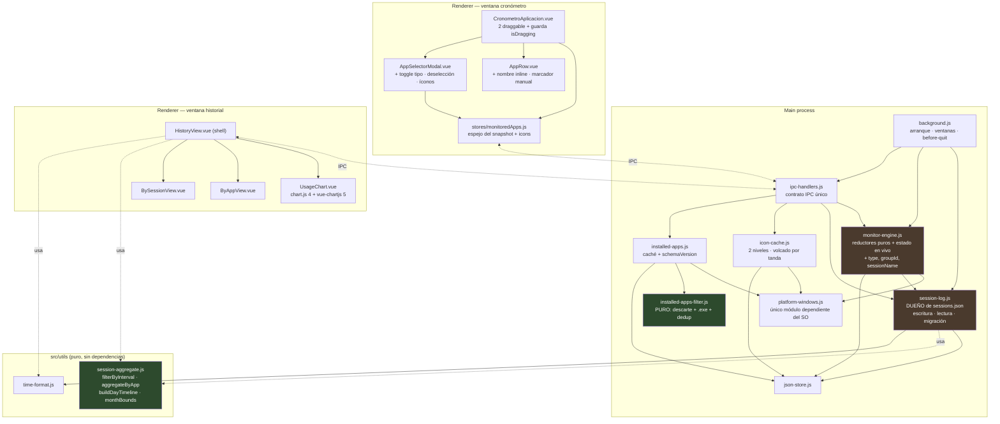
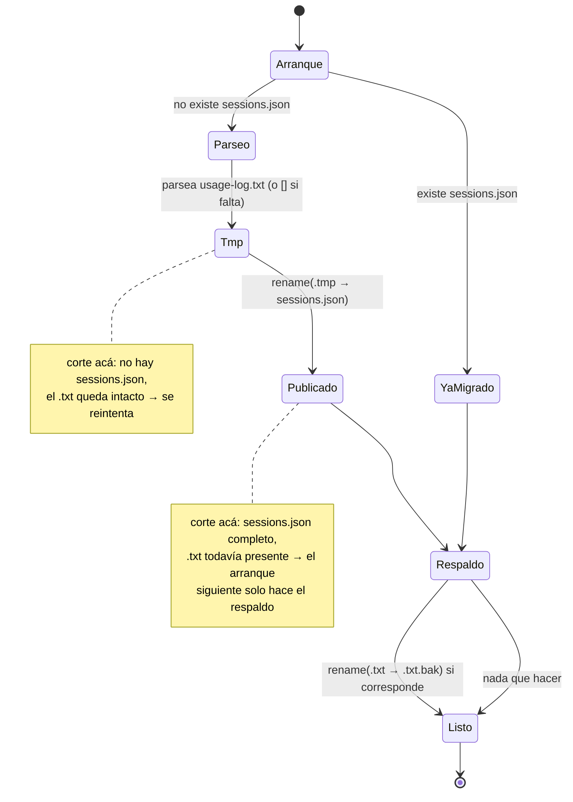

# Design: sessions-groups-history

Diseño técnico de los nueve puntos del intent, sobre las diez specs de `spec_refs` y las
decisiones D1-D6 de la propuesta aprobada (iteración 2). Las decisiones de producto no se
reabren: acá se resuelve **cómo** se implementan, dónde vive cada pieza y qué contrato tiene.

**ADRs producidos**: [[0007-structured-sessions-json-with-one-shot-migration]],
[[0008-sessions-and-groups-as-entry-metadata]],
[[0009-typed-selection-with-atomic-manual-removal]],
[[0010-charting-library-confined-to-history-bundle]].
**ADRs vigentes que este diseño obedece sin modificar**: [[0001-two-signal-monitoring-engine]],
[[0002-main-process-owns-monitoring-state]], [[0003-start-menu-installed-apps-enumeration]],
[[0004-os-dependent-code-single-module]], [[0005-native-icon-extraction-css-grayscale]].
[[0006-userdata-json-persistence]] queda **enmendado** por 0007 en una sola cláusula
(el formato de `usage-log.txt`); el resto sigue vigente.

---

## 0. Validaciones empíricas ejecutadas en esta fase

El entorno tiene interop WSL→Windows y el `userData` real de la aplicación instalada. Todas
las suposiciones de diseño que podían verificarse se verificaron antes de decidir. Esta tabla
es la evidencia; cada fila se usa más abajo.

| # | Qué se verificó | Cómo | Resultado |
|---|---|---|---|
| V1 | Formato de `usage-log.txt` real | Parseo con la regex de `background.js:215` sobre el archivo del `userData` | 32 líneas, **0 sin match**, 9 días distintos, 2025-04-06 → 2026-08-02, 10 programas |
| V2 | ¿La duración se deduce de inicio y fin? | Inspección de líneas reales | **No**. `Duración: 00:00:05 \| Inicio: 11:41:06 \| Fin: 11:42:24` — el reloj no cuenta en pausa. `Duración` es el único dato autoritativo |
| V3 | Datos degradados en el log | Grep sobre el archivo real | Existe `Aplicación: null \| … \| Inicio: 00:00:00`, y tres líneas de Chrome **duplicadas exactas** |
| V4 | Fix de encoding PowerShell | `powershell.exe -NoProfile -Command` con y sin `[Console]::OutputEncoding`, hexdump de la salida | Sin fix: `ú`=`0xa3`, `ó`=`0xa2` (CP-850). Con fix: `c3 ba`, `c3 b3` (UTF-8). **Confirmado en la forma exacta que usa el código** |
| V5 | ¿`ConvertTo-Json` escapa a `\uXXXX`? | `[PSCustomObject]@{n='Cronómetro versión'} \| ConvertTo-Json`, hexdump | **No escapa**: emite bytes crudos en la codificación de consola. El fix de V4 es suficiente en la capa JSON |
| V6 | Caché de instaladas real | Análisis de `installed-apps-cache.json` (106 entradas) | Claves de nivel superior: `['apps','cachedAt']` — **sin `schemaVersion`**, así que la invalidación por versión la descarta entera |
| V7 | Fuga del filtro `.exe` | Simulación del filtro nuevo sobre las 106 entradas | **15 descartadas**: `.chm`, `.html`, `.url`, `.txt`, `.ico` |
| V8 | Duplicados por `appId` | Conteo sobre las mismas 106 entradas | **11 `appId` repetidos** (no 3, como estimó `sdd-explore`) → **9 filas** de más tras el filtro `.exe`. Incluye ejecutables legítimos: Steam, VLC ×3, WinRAR, Cursor, Ollama, Python, wslg, MySQL |
| V9 | Resultado del filtro completo | `.exe` + dedup sobre datos reales | 106 → 91 → **82 entradas** |
| V10 | Corrupción de nombres que sobrevive al filtro | Inspección de las 82 | **3 entradas** con carácter de reemplazo (`Cron?metro App`, `Navegaci?n privada con Firefox`, `Registro de telemetr?a para Office`) → confirma que el filtro no autorrepara y que hace falta la invalidación de caché |
| V11 | `vuedraggable` cross-list (riesgo declarado) | Lectura del código real de `sortablejs@1.14.0` y `vuedraggable@4.1.0` descargados con `npm pack` | **Riesgo cerrado** — ver §5 |
| V12 | API de rango de `v-calendar` 3.1.2 | Lectura de `dist/types/src/use/datePicker.d.ts` y `dist/es/index.js` del paquete real | `v-model.range` (v3) — **no** `is-range` (v2, que es lo que devuelve la documentación pública). `<v-date-picker>` ya está registrado globalmente |
| V13 | Compatibilidad de las dependencias nuevas | `npm view` de peer deps | `vue-chartjs@5.3.4` exige `vue ^3.0.0-0 \|\| ^2.7.0` y `chart.js ^4.1.1`. El lock resuelve `vue@3.5.13` → compatible |
| V14 | Versiones reales del proyecto | `package-lock.json` (lockfileVersion 3) | `vue@3.5.13` (no 3.2), `sortablejs@1.14.0`, `v-calendar@3.1.2`, `electron@13.6.9` |
| V15 | Fecha del historial y zona horaria | `TZ=America/Santiago node -e …` | **Defecto preexistente**: `HistoryView` filtra con `toISOString().split('T')[0]` (UTC) contra un `date` que `session-log.js` escribe en hora local. Abrir el historial a las 21:00 en Chile consulta el **día siguiente** y muestra la lista vacía |

Los tres archivos de documentación consultados vía context7 están consolidados en
`tech-context.md` (consulta única, [[0024-context7-tech-context-ssot]]).

---

## Decisiones Técnicas

### D-1: `sessions.json` — forma de la entrada y propiedad de la escritura

**Contexto**: D1 de la propuesta fija migrar a JSON. Falta definir la forma exacta, quién
escribe, quién lee, y cómo se consulta por intervalo. Hoy la escritura vive en
`session-log.js` y la lectura (regex) en `background.js:215`, una asimetría preexistente.

**Decisión**: una entrada por sesión cerrada, con esta forma:

```javascript
{
  id:          '1785685048769-0',   // `${endedAt}-${contador}`, único dentro del proceso
  date:        '2026-08-02',        // YYYY-MM-DD en hora LOCAL
  appId:       'c:\\program files\\…\\brave.exe',
  app:         'Brave',
  startedAt:   1785685036000,       // epoch ms
  endedAt:     1785685048769,       // epoch ms
  durationMs:  12000,               // tiempo acumulado en estado corriendo
  sessionName: null,                // String | null
  groupId:     null,                // String | null
  groupName:   null,                // String | null
}
```

`session-log.js` pasa a ser **dueño único del archivo**: lo carga una vez al arrancar, lo
mantiene parseado en memoria, y cada cierre hace `push` + `jsonStore.writeJson` sincrónico.
El parser regex de `background.js` se elimina, junto con el canal `get-app-logs`.

**Justificación**: `date` en `YYYY-MM-DD` local convierte el filtro por intervalo en una
comparación de strings ordenada (`from <= date && date <= to`), sin librería de fechas —es
lo que hace que día, mes y rango salgan del mismo agregador (D-8)—. `startedAt`/`endedAt` en
epoch ms eliminan la ambigüedad de zona horaria que V15 expuso, y el formateo a `HH:MM:SS`
queda del lado que muestra. Mantener el array en memoria evita releer el archivo por cada
cierre y es lo que habilita el volcado sincrónico de `before-quit` (D-4). Detalle completo y
alternativas en [[0007-structured-sessions-json-with-one-shot-migration]].

**Alternativas descartadas**: extender la línea de texto con dos campos más (un `|` en un
nombre escrito por el usuario corrompe el parseo); JSON solo para lo nuevo con el `.txt`
legado leído en paralelo (dos fuentes a fusionar para siempre); append por línea en formato
JSONL (evita reescribir el archivo, pero vuelve a poner el parseo en cada lectura y no se
puede mantener en memoria sin releer). Argumentadas en el ADR.

---

### D-2: Migración one-shot, idempotente y no destructiva

**Contexto**: hay historial real desde 2025-04 (V1) y la propuesta clasifica su pérdida como
riesgo de impacto irrecuperable. V2 y V3 muestran que el parser de migración no puede ser
ingenuo.

**Decisión**: `session-log.js::migrateLegacyLog()` corre al arrancar, **de forma sincrónica y
antes de `monitorEngine.loadSelection()`**, con este orden invariante:

```
1. si existe sessions.json                    → no migra (ya migrado)
2. si no existe:
     a. parsea usage-log.txt completo (si falta → [])
     b. escribe sessions.json.tmp
     c. renombra .tmp → sessions.json          ← el archivo aparece ya completo
3. si existe usage-log.txt y NO existe usage-log.txt.bak
     → renombra usage-log.txt → usage-log.txt.bak
```

Reglas de reconstrucción, derivadas de la evidencia:

| Campo | Regla | Evidencia |
|---|---|---|
| `durationMs` | del campo `Duración`, **nunca** de `endedAt - startedAt` | V2 |
| `date` | de la parte de fecha del prefijo `[YYYY-MM-DD HH:MM:SS]` | V1 |
| `endedAt` | `date` + campo `Fin`, en hora local | — |
| `startedAt` | `date` + campo `Inicio`, en hora local; **menos un día si `Inicio > Fin`** | sesión que cruzó medianoche |
| `app` | del campo `Aplicación` tal cual, incluido el literal `"null"` | V3 |
| `appId` | `null`: el formato viejo no lo guardaba | — |
| `sessionName`, `groupId`, `groupName` | `null` | — |
| líneas sin match | se descartan contando cuántas fueron (log a consola) | V1 dice 0 hoy |
| líneas duplicadas exactas | **se migran tal cual** | V3 |

**Justificación**: el paso 2 es atómico por construcción —`sessions.json` solo aparece por un
renombre de un archivo ya escrito entero, así que no existe el estado "a medio migrar"—, y los
pasos 2 y 3 son idempotentes e independientes, de modo que cualquier interrupción se resuelve
sola en el arranque siguiente. El original nunca se borra. Correr antes de `loadSelection()`
cierra el único agujero del guard "existe `sessions.json`": si el motor pudiera appendear
antes, crearía el archivo y la migración se saltearía perdiendo el historial legado.

**Alternativas descartadas**: usar un flag en `settings.json` como marca de migración (dos
fuentes de verdad sobre el mismo hecho, y desincronizables); borrar el `.txt` tras migrar
(destruye la única copia de datos irrecuperables); deduplicar las líneas repetidas (no hay
forma de distinguir un duplicado espurio de dos sesiones reales idénticas).

---

### D-3: Nombre de sesión y grupo como campos de la fila, congelados al cerrar

**Contexto**: `inline-session-naming` exige nombre editable mientras la sesión está abierta y
congelado al cerrarse; `group-composition-and-drag` exige que el grupo viva mientras existan
sus filas y que el total sea derivado.

**Decisión**: `sessionName`, `groupId` y `groupName` son propiedades de la fila en el estado
en memoria del main, al mismo nivel que `elapsedMs`. Viajan en el snapshot. Se copian a la
entrada del historial al cerrarse la sesión, y ahí quedan congelados —no por una regla, sino
porque la fila dejó de existir—. No hay colección de grupos, ni archivo de grupos, ni total
persistido. Dos intenciones nuevas por IPC: `rename-session(appId, name)` y
`rename-group(groupId, name)`; la segunda escribe `groupName` en todas las filas del grupo.

**Justificación y alternativas**: [[0008-sessions-and-groups-as-entry-metadata]].

---

### D-4: Cierre de sesiones al salir — sincrónico, en `before-quit`

**Contexto**: hoy salir de la aplicación pierde la sesión en curso; no hay handler de salida
(verificado en `background.js:260`). D2c lo mete en alcance porque sin él la semántica de
"manual" no es definible.

**Decisión**: `app.on('before-quit', () => monitorEngine.closeAllRows('app-quit'))`.
`closeAllRows` cierra todas las filas abiertas y las registra en **una sola** operación
`sessionLog.appendSessions(rows, endDate)`, que hace un único `jsonStore.writeJson`
sincrónico. `session-log.js` deja de usar `fs.appendFile` (asíncrono) en todos sus caminos.

**Justificación**: el trabajo dentro de `before-quit` debe ser sincrónico —una escritura
asíncrona no tiene garantía de completarse antes de que el proceso termine— y hoy
`appendSession` usa `fs.appendFile` con callback, que no sobreviviría al cierre. Mantener el
array de sesiones en memoria (D-1) hace que el volcado sea un único `writeFileSync` sin
lectura previa. Los dos caminos de salida existentes convergen en `before-quit`: el menú de
la bandeja (`app.isQuiting = true; app.quit()`) y `window-all-closed → app.quit()`.

**Riesgo residual aceptado**: la documentación de Electron declara que `before-quit` y
`will-quit` **pueden no emitirse en Windows** durante apagado, reinicio o cierre de sesión del
sistema. Un apagado forzado sigue perdiendo la sesión abierta —igual que hoy—; el cambio cubre
la salida normal, que es el caso que el intent describe.

**Alternativas descartadas**: `will-quit` (se emite después de cerrar las ventanas, más tarde
de lo necesario y con la misma limitación); persistir el estado en vivo periódicamente para
reconstruir al arrancar (contradice ADR-0006 y exigiría validar contra el sistema al
arrancar, que es lo que el motor ya hace); `app.exit()` en algún camino (no emite ningún
evento del ciclo de vida — queda prohibido en este código).

---

### D-5: Selección tipada y baja atómica de la entrada manual

**Contexto**: es el riesgo de probabilidad **Alta** de la propuesta. `reduceLifecycle` recorre
`selection` para evaluar altas **después** de dar de baja filas por PID muerto: si la baja de
la entrada manual ocurre fuera del reductor, el mismo tick la ve todavía en `selection`, la
muestra de foco ya puso su PID en `discovered`, y recrea la fila que se acaba de cerrar.

**Decisión**: campo `type: 'manual' | 'auto'` en cada entrada de `monitored-selection.json`
(ausente = `'auto'`, normalizado una sola vez al cargar), y **la baja se resuelve dentro de
`reduceLifecycle`, en el mismo paso que la baja de la fila y antes de evaluar altas**. El
reductor cambia de contrato a `{ rows, selection, closed }` y sigue siendo puro. `closeRow`
hace lo propio de forma sincrónica para el camino del ■. Reconciliación única al arrancar,
antes de `startEngine()`, que descarta entradas manuales sin proceso vivo.

**Justificación, orden interno exacto, invariantes y alternativas**:
[[0009-typed-selection-with-atomic-manual-removal]].

---

### D-6: Deselección desde el modal — confirmación de la inferencia de `sdd-spec`

**Contexto**: el despacho pide **confirmar o ajustar** la inferencia de que desmarcar un
programa con fila activa cierra y registra la fila, con el mismo efecto que ■.

**Decisión: la inferencia se CONFIRMA, sin ajustes.** No es una decisión nueva de diseño: es
el comportamiento que el código ya tiene. `monitor-engine.js:378-388`
(`removeFromSelection`) quita la entrada, persiste, y si había fila llama
`closeRow(appId, 'removed-from-selection')`, que registra la sesión por el mismo camino que
el ■ (`closeRow` es una única función compartida). El canal `remove-from-selection`
(`ipc-handlers.js:27-30`) y la acción `removeApp` del store (`monitoredApps.js:31-34`) ya
existen y ya devuelven el snapshot actualizado.

Queda escrito como regla explícita, porque hasta ahora solo estaba implícita en el código:

> Desmarcar un programa desde el selector produce **exactamente el mismo efecto observable**
> que presionar ■ sobre su fila, más la baja de la selección guardada. La modalidad no altera
> ese efecto: desmarcar saca de la selección tanto a las manuales como a las automáticas.

Lo único que falta es el gesto de UI, y ahí el diseño sí decide dos cosas que el código actual
impide y que hay que corregir juntas:

1. **`choose()` corta antes de tiempo.** `AppSelectorModal.vue:121` hace
   `if (this.monitoredApps.limitReached || this.isSelected(appEntry.appId)) return`. El orden
   de los operandos importa: con el listado lleno, `limitReached` es verdadero y **la
   deselección quedaría bloqueada justo cuando más se necesita** (para liberar un lugar). El
   guard se reordena: si ya está seleccionado → `removeApp` y salir; **después** evaluar
   `limitReached` para el alta.
2. **El CSS bloquea el click.** `.selector-list li.disabled { pointer-events: none }` se
   aplica con `:class="{ disabled: monitoredApps.limitReached }"` (línea 32), es decir a
   **todas** las filas, incluidas las ya seleccionadas. La condición pasa a ser
   `monitoredApps.limitReached && !isSelected(appEntry.appId)`.

Sin las dos correcciones a la vez, el escenario "detener una fila cuando el listado está en el
límite habilita agregar otro programa" queda accesible solo por el ■ y no por el selector.

**Alternativas descartadas**: diálogo de confirmación al desmarcar un programa con fila activa
(`sdd-explore` approach B) — se descarta por consistencia: cerrar una fila con ■ tampoco
confirma, y la sesión no se pierde sino que se registra; un control de "quitar" separado del
checkmark — se descarta porque duplica el gesto y el checkmark ya comunica el estado
binario.

---

### D-7: Grupos con `vuedraggable` cross-list — riesgo cerrado y mecánica

**Contexto**: la propuesta condiciona el approach a un **prototipo mínimo de validación**
(riesgo: "`vuedraggable`/SortableJS cross-list sin precedente en el repo").

**Validación ejecutada (V11)** — sobre el código real de `sortablejs@1.14.0` y
`vuedraggable@4.1.0` descargados con `npm pack`, no sobre documentación:

1. **`group` como string ya habilita el cross-list.** `sortable.esm.js:1121` `_prepareGroup`
   normaliza `group: 'x'` a `{name, checkPull, checkPut}`, y `toFn` resuelve
   `if (value == null && (pull || sameGroup)) return true` — con `pull`/`put` sin especificar
   y el mismo `name` en las dos listas, ambos chequeos dan verdadero. **No hace falta
   configurar `pull`/`put`**; solo servirían para restringir.
2. **Se arrastra exactamente un elemento.** `sortable.esm.js:1447`: `dragEl = target`, uno por
   gesto. El arrastre múltiple vive en `MultiDragPlugin` (línea 3166), un plugin aparte que
   hay que montar explícitamente y que `vuedraggable` no monta.

→ **El riesgo queda cerrado**: mover una fila individual sin arrastrar el grupo completo es el
comportamiento por defecto, no una configuración a descubrir. El approach A de `sdd-explore`
se confirma.

**Hallazgo adicional de la validación, que sí cambia el diseño**: `vuedraggable` **muta el
array vinculado y manipula el DOM directamente** (`onDragAdd` → `removeNode` + `spliceList`;
`onDragRemove` → `insertNodeAt` + `spliceList`). Eso choca de frente con ADR-0002: el store
reemplaza `rows` entero **cada 1000ms**. Vincular `v-model` al store haría que el snapshot
siguiente pisara el resultado del arrastre, y peor, que el array se reemplazara **en medio de
un gesto**, dejando DOM y vdom desalineados.

**Decisión**:

- `CronometroAplicacion.vue` sostiene dos arrays locales, `dragUngrouped` y `dragGrouped`,
  **derivados** del snapshot por un `watch` sobre `monitoredApps.rows`.
- Dos `<draggable>` con `group="monitored-rows"` e `item-key="appId"`, uno por array.
- `@change` traduce el gesto a una **intención**: `{added:{element}}` en el contenedor de
  grupo → `set-row-group(appId, groupId)`; en el listado suelto → `set-row-group(appId, null)`.
  El main aplica y emite el snapshot, que reconstruye ambos arrays. La mutación local
  optimista se descarta.
- **Guarda `isDragging`**: se activa en `@start` y se libera en `@end`; mientras está activa el
  `watch` no reconstruye los arrays, y aplica la reconstrucción pendiente al soltar. Sin esta
  guarda, un snapshot llegando en mitad del arrastre rompe el gesto.
- **Un solo grupo activo a la vez.** D3b habla de "el contenedor" en singular, y con el límite
  de 4 filas vigente dos grupos de dos es un caso que nadie pidió (YAGNI). El modelo
  (`groupId` por fila) soporta N grupos sin cambios: el límite está en la interfaz, no en los
  datos.
- El contenedor aparece como franja delgada cuando hay **≥2 filas sueltas** y se convierte en
  cabecera con nombre editable al recibir la primera fila. Un grupo que se queda sin filas
  vuelve a ser la franja.

**Alternativas descartadas**: `v-model` directo sobre `monitoredApps.rows` (el snapshot lo
pisa cada segundo y rompe D17/ADR-0002); estado de grupo propio en el store exceptuado de la
mutación de reemplazo (reintroduce la divergencia que ADR-0002 eliminó); HTML5 Drag and Drop
nativo (hay que resolver ghost, zonas de drop y feedback a mano, sin beneficio sobre una
librería ya en el proyecto); revivir `@shopify/draggable` o `fluid-dnd` (dependencias muertas,
una de ellas apuntando a un `.tgz` fuera del repo).

---

### D-8: Agregador por intervalo — módulo puro compartido

**Contexto**: `usage-chart-by-interval` exige un solo gráfico para tres alcances, y
`session-view` exige agrupar las sesiones de un día en bloques por grupo. Ambas necesitan
lógica de agregación, y el proyecto no tiene test runner: lo que sea puro es lo único
verificable con entradas fabricadas.

**Decisión**: un módulo **puro y sin dependencias**, `src/utils/session-aggregate.js`
(CommonJS, mismo patrón y misma ubicación que `src/utils/time-format.js`, ya importado por
main y renderer):

```javascript
filterByInterval(entries, from, to)  // comparación de strings sobre `date`, inclusivo
aggregateByApp(entries)              // → [{ appId, app, durationMs }] desc por durationMs
buildDayTimeline(entries)            // → bloques cronológicos, los del mismo groupId colapsados
monthBounds(dateStr)                 // 'YYYY-MM-DD' → { from: 'YYYY-MM-01', to: 'YYYY-MM-<último>' }
```

`buildDayTimeline` devuelve una lista ordenada por `startedAt` donde cada elemento es
`{ type: 'session', entry }` o
`{ type: 'group', groupId, groupName, durationMs, members: [] }`, con el total del grupo
calculado como **suma** de `durationMs` de sus miembros (D3) y la posición del bloque dada por
el `startedAt` mínimo de sus miembros.

**Justificación**: el criterio de aceptación "el gráfico refleja los mismos totales que la
lista por aplicación cuando el alcance es el día" se cumple por construcción si las dos usan
`aggregateByApp` sobre el mismo conjunto filtrado. Y ser puro y sin dependencias es lo que lo
hace verificable sin Windows, sin Electron y sin timers —el mismo criterio que ADR-0003 aplicó
a `installed-apps-filter.js`—.

**Alternativas descartadas**: agregar en el componente Vue (no verificable sin montar el
componente, y duplicaría la lógica entre la lista y el gráfico); agregar en el main y mandar
el resultado ya digerido por IPC (obligaría a un canal por forma de agregación y a un
round-trip por cada cambio de alcance, cuando el intervalo más grande cabe holgadamente en
memoria del renderer).

---

### D-9: Consulta del historial por IPC — dos canales, filtrado en el main

**Contexto**: `sessions-json-persistence` pide consultar por rango arbitrario "sin que el
tiempo de respuesta se degrade a medida que el historial crece". El canal actual
`get-app-logs` devuelve el archivo entero parseado, sin filtrar.

**Decisión**: `get-app-logs` se elimina y lo reemplazan dos canales registrados en
`ipc-handlers.js` (no en `background.js`):

| Canal | Entrada | Salida |
|---|---|---|
| `get-sessions` | `{ from: 'YYYY-MM-DD', to: 'YYYY-MM-DD' }` | entradas del intervalo, ordenadas por `startedAt` |
| `get-session-dates` | — | `['YYYY-MM-DD', …]` únicas, para los puntos del calendario |

El filtrado corre en el main sobre el array ya en memoria (D-1), con `filterByInterval` del
módulo puro (D-8): la misma función que usa el renderer, un solo criterio de intervalo.

**Justificación**: acota el payload al intervalo pedido en vez de mandar el historial completo
en cada apertura, y mueve el registro de canales al lugar donde ADR-0002 puso el contrato IPC.
`get-session-dates` es una proyección barata de un campo ya indexable.

**Alternativas descartadas**: un solo canal que devuelva todo y filtrar en el renderer (es lo
que hace hoy, y es exactamente lo que el requisito pide evitar); un canal por vista
(`get-day-summary`, `get-chart-data`, …) — multiplicaría el contrato IPC por cada forma de
presentación, cuando el dato crudo del intervalo sirve a las tres.

---

### D-10: Estructura de componentes de la ventana de historial

**Contexto**: `HistoryView.vue` tiene 245 líneas con calendario, tabla, parseo y formateo en
un solo archivo. El cambio le suma una segunda vista, un gráfico, un selector de alcance y un
selector de rango. `sdd-explore` dejó la decisión a esta fase.

**Decisión**: se parte (approach B de `sdd-explore`), con el shell reteniendo todo el estado:

```
src/history/HistoryView.vue    shell: TitleBar, calendario, selector de alcance,
                               gráfico, pestañas de vista. Dueño de selectedDate,
                               chartScope, customRange, y de la carga por IPC.
src/history/UsageChart.vue     <Bar> de vue-chartjs + registro + opciones oscuras +
                               cabecera con el rótulo del intervalo vigente.
src/history/ByAppView.vue      tabla actual (colapso por programa), sobre el día.
src/history/BySessionView.vue  lista cronológica del día, con los grupos como bloque.
```

Las dos vistas son **de presentación pura**: reciben las entradas del día ya filtradas y no
hacen IPC, mismo criterio que `AppRow.vue` (D12 del cambio anterior). El estado vive en el
shell porque las dos listas y el gráfico comparten el día seleccionado y solo el gráfico
depende del alcance.

**Anclaje (D5, sin reabrir)**: las dos listas siguen el **día del calendario**; el selector de
alcance gobierna **solo el gráfico**. La cabecera del gráfico rotula siempre el intervalo
vigente, que es la mitigación declarada para la asimetría.

**Corrección obligatoria de un defecto preexistente (V15)**: `loadLogsForDate` compara con
`date.toISOString().split('T')[0]` (UTC) contra un `date` escrito en hora local. Verificado:
en Chile (UTC-4), abrir el historial a las 21:00 consulta el día siguiente y muestra la lista
vacía. Todo el manejo de fechas de la ventana pasa a usar `formatDateYYYYMMDD` de
`src/utils/time-format.js` —la misma función que escribe el campo— como fuente única. Sin
esto, el criterio "el gráfico coincide con la lista por aplicación" falla por la tarde.

**Deuda adyacente que se limpia**: el modal de historial muerto de
`CronometroAplicacion.vue` (líneas 33-45 del template, referencias a `showHistory`,
`filteredLogs`, `loadLogsForDate` inexistentes en el script) se elimina en este cambio. Está
registrado como debt candidate en `observations.md`, este cambio ya modifica ese archivo por
D-7, y sobrevive solo porque `showHistory` es `undefined`. Consumía el canal `get-app-logs`,
que D-9 elimina: dejarlo sería dejar código muerto apuntando a un canal inexistente.

**Alternativas descartadas**: mantener todo en `HistoryView.vue` con `v-if` (approach A) — el
archivo pasaría de 245 líneas a más del doble con tres responsabilidades nuevas; extraer
también un componente por bloque de grupo (fragmentación sin reuso, YAGNI).

---

### D-11: Configuración del gráfico sobre el tema oscuro

**Contexto**: D5b fija barras horizontales por aplicación, tema oscuro plano, sin grid ni ejes
decorativos, el alto creciendo con la cantidad de aplicaciones y el contenedor con scroll, sin
top-N ni categoría "Otras".

**Decisión**:

- `indexAxis: 'y'` sobre `type: 'bar'` — un único dataset, un color plano.
- Registro **explícito y mínimo**: `BarElement`, `CategoryScale`, `LinearScale`, `Tooltip`.
  Sin `Legend` (un solo dataset) ni `Title` (la cabecera es HTML propio: más barata, y es la
  que rotula el intervalo). Sin `chart.js/auto`.
- Tema por **defaults globales**, fijados una vez: `ChartJS.defaults.color = '#f0f0f0'`,
  `ChartJS.defaults.font.family = "'Architects Daughter', cursive"`.
- `scales.x.grid.display = false` y `scales.y.grid.display = false` ("sin grid ni ejes
  decorativos"); `scales.x.ticks.callback` formatea la duración a una forma legible, y el
  tooltip la muestra en `HH:MM:SS`.
- `responsive: true` + `maintainAspectRatio: false`, con el **alto del contenedor calculado**
  como `nApps * altoDeBarra + margen` y el contenedor con `overflow-y: auto` y `max-height`.
  Así se cumple "crece según la cantidad de aplicaciones y se recorre por desplazamiento sin
  comprimir ni ocultar ninguna".
- El dataset se construye en un `computed` a partir de `aggregateByApp` (D-8), lo que además
  evita el warning `Target is readonly` de `vue-chartjs`.
- **Sin adaptador de fechas**: el eje de categorías son nombres de programa, no fechas.

**Nota tipográfica**: `Architects Daughter` se importa hoy desde Google Fonts en
`src/App.vue`, que pertenece al bundle `index`. La ventana de historial usa
`font-family: sans-serif` y **no** carga esa fuente. Aplicarla obliga a importarla también en
el bundle de historial, con la misma dependencia de red que ya tiene la ventana principal:
sin conexión, cae a la tipografía de respaldo. Declarado en
[[0010-charting-library-confined-to-history-bundle]].

**Alternativas descartadas**: SVG a mano; `uPlot`/`frappe-charts`; serie temporal por día para
mes y rango (responde "cuándo", que el calendario ya responde, y no es la pregunta del intent
— excluida explícitamente del alcance); top-N con categoría "Otras" (descartaría datos por una
regla arbitraria, contra el criterio de aceptación).

---

### D-12: Selector de alcance y rango con `v-calendar` 3

**Contexto**: tres alcances (día / mes / rango). `v-calendar` ya está en el proyecto y ya se
usa para el calendario del historial.

**Decisión**: un control de tres opciones en el shell (`chartScope: 'day' | 'month' |
'range'`). El intervalo se deriva así:

| Alcance | `from` | `to` |
|---|---|---|
| `day` | `selectedDate` | `selectedDate` |
| `month` | `monthBounds(selectedDate).from` | `monthBounds(selectedDate).to` |
| `range` | `customRange.start` | `customRange.end` |

Para `range` se usa **`<v-date-picker v-model.range="customRange" />`**, que expone
`{ start: Date, end: Date }`.

**Justificación (V12)**: verificado leyendo los tipos del paquete real —
`ModelModifiers { number?, string?, range? }` y
`DatePickerRangeObject { start, end }` en `dist/types/src/use/datePicker.d.ts` —, y que
`app.use(VCalendar)` registra `VCalendar`/`VDatePicker` con prefijo `V`, así que
`<v-date-picker>` ya está disponible sin instalar nada.

**Advertencia explícita para `sdd-apply`**: la documentación pública que devuelve context7
corresponde mayormente a **v-calendar 2** y muestra `<v-date-picker v-model="range" is-range>`.
Esa es la API vieja. En 3.1.2 la forma vigente es el **modificador `v-model.range`**; `isRange`
sigue existiendo como legado y no debe usarse en código nuevo.

**Alternativas descartadas**: `vue3-datepicker` (está en `package.json` pero sin uso conocido
en el historial; usar dos librerías de fechas en la misma ventana es duplicación); dos inputs
`<input type="date">` (funciona, pero rompe la coherencia visual con el calendario que ya
domina la ventana).

---

### D-13: Encoding, `schemaVersion`, filtro `.exe` y deduplicación

**Contexto**: los tres defectos de calidad de datos (P7, P8) más el hallazgo de duplicados.

**Decisión**, en las cuatro piezas verificadas:

1. **Encoding (V4, V5)**: `[Console]::OutputEncoding = [System.Text.Encoding]::UTF8;` como
   **primera sentencia** de las **dos** invocaciones PowerShell de `platform-windows.js`
   (`listOpenWindows`, línea 99; `buildInstalledAppsScript`, líneas 127-152). Son dos y no
   tres, confirmado por grep de todo el árbol. `exec()` de Node ya decodifica UTF-8 por
   defecto, así que no hace falta tocar el lado JavaScript.
2. **`schemaVersion` (V6)**: la caché pasa a escribirse como
   `{ schemaVersion: 2, apps, cachedAt }`, y `getInstalledApps()` trata un `schemaVersion`
   ausente o distinto del vigente **como si no hubiera caché** (devuelve el estado de carga y
   enumera), en vez de servir el dato viejo. La caché real de este entorno tiene claves
   `['apps','cachedAt']` sin `schemaVersion`, así que se invalida sola en la primera apertura
   tras actualizar.
3. **Filtro `.exe` (V7)**: una condición más en `shouldDiscard`, descartando todo `targetPath`
   que no termine en `.exe`. Descarta exactamente las 15 entradas `.chm`/`.html`/`.url`/
   `.txt`/`.ico` del listado real, incluidas las dos que nombra el intent.
4. **Deduplicación (V8, V9)**: en `filterInstalledApps`, tras el filtro, conservando la
   primera aparición de cada `appId`. Quita **9 filas** más. El hallazgo es mayor que el
   estimado por `sdd-explore` (11 `appId` repetidos, no 3) y alcanza a ejecutables legítimos
   —Steam, VLC ×3, WinRAR, Cursor, Ollama, Python, wslg, MySQL—, no solo a los archivos de
   ayuda. Resultado final verificado: **106 → 91 → 82**.

El filtro y la deduplicación viven en la **función pura** `installed-apps-filter.js`, no en el
script PowerShell: es la frontera que fija ADR-0003 y lo que los hace verificables con
entradas fabricadas sin Windows.

**Por qué las cuatro juntas y no solo el encoding**: V10 lo demuestra. Tras aplicar filtro y
dedup sobre el listado real, **sobreviven 3 entradas con nombres corruptos** —incluida la
propia `Cron?metro App`, cuyo `exePath` corrupto no existe en disco y por eso hace fallar
silenciosamente `getExecutableIcon`—. El fix de encoding arregla la enumeración futura; la
invalidación por versión es lo que fuerza a que esa enumeración ocurra antes de servir lo que
ya está corrupto en disco.

**Alternativas descartadas**: `chcp 65001` en vez de `[Console]::OutputEncoding` (afecta la
consola entera y es más frágil ante perfiles de PowerShell); borrar el archivo de caché en un
paso de arranque (funciona una vez, pero deja el problema sin mecanismo para la próxima vez
que cambie la forma del archivo); TTL sobre `cachedAt` (resuelve obsolescencia, no
incompatibilidad de forma, que es el problema real); filtrar dentro del script PowerShell
(enterraría un criterio de aceptación en una cadena de texto no verificable sin Windows).

---

### D-14: `persistToDisk` por tanda, prerequisito de los íconos del selector

**Contexto**: el selector mostrará ícono para ~82 entradas. `icon-cache.js::persistToDisk`
(líneas 41-50) encola una operación **lectura completa + mutación + escritura completa** por
cada ícono; una tanda de N íconos nuevos cuesta N lecturas y N escrituras de un archivo que
crece con cada una. La propuesta lo declara prerequisito real del punto 9.

**Decisión**: la cola pasa de una escritura por ícono a **una escritura por tanda**. Las
entradas pendientes se acumulan en un `Map`; se agenda un único volcado que, cuando le toca el
turno, lee el archivo una vez, mezcla todo lo pendiente y escribe una vez.

Las dos propiedades que el código actual ganó a golpes y que **hay que preservar**:

- **S1** (no perder claves de escrituras concurrentes): se conserva porque la lectura del
  archivo sigue ocurriendo dentro del turno de la cola, y el `Map` de pendientes acumula todo
  lo que llegó mientras tanto. Nada se lee "antes de esperar".
- **F1** (la cola nunca queda como promesa rechazada): se conserva el `.catch` final, que
  además limpia el estado de agendado y las pendientes para que el próximo ícono pueda volver
  a agendar. Sin eso, una única falla de disco dejaría la caché inutilizada por el resto del
  proceso.

**Justificación**: el costo de la primera apertura del selector pasa de crecer con el cuadrado
de las entradas nuevas a un único ciclo lectura+escritura, sin cambiar el contrato de
`getIcon` ni la forma del archivo.

**Alternativas descartadas**: lazy-loading por viewport (excluido explícitamente del alcance
por la propuesta: el costo real está en la persistencia, no en renderizar 82 `<li>`);
escritura sin cola (es exactamente el defecto que el fix S1 corrigió).

---

### D-15: Íconos en el listado del selector

**Contexto**: `selector-listing-icons` exige que la primera apertura no muestre demora
perceptible y que aperturas siguientes no repitan la extracción.

**Decisión**: se reutiliza la infraestructura existente sin duplicar nada.

- El mapa `icons` del store `monitoredApps` (clave `exePath`) es el mismo para las filas del
  widget y para el listado del selector. El guard por `hasOwnProperty` que ya tiene
  `ensureIcon` cubre el caso del ícono resuelto en `null`.
- El modal pide los íconos **del listado ya limpio** (después de D-13: 82 entradas, sin
  `.chm` ni duplicados; pedir el ícono de un `.chm` o de un `exePath` corrupto es trabajo
  garantizado inútil). De ahí que la etapa de calidad de datos vaya **antes** que esta.
- Se agrega `ensureIcons(exePaths)` al store: recorre la lista con **concurrencia acotada**
  (6 en vuelo) en vez de disparar 82 `invoke` simultáneos. El listado se renderiza de
  inmediato con la imagen de respaldo y cada ícono aparece cuando llega —que es literalmente
  el escenario "el listado se muestra y responde con normalidad mientras los íconos se
  completan"—.
- El `` del `<li>` usa `filter: grayscale(1)`, igual que `AppRow.vue`, y el mismo
  respaldo `public/img/idk.png`.

**Justificación**: la concurrencia acotada existe porque el main process que extrae los íconos
es el mismo que corre el tick de 1000ms del motor: 82 llamadas nativas simultáneas compiten
con el reloj. Seis en vuelo mantienen el pipeline lleno sin monopolizar el proceso.

**Alternativas descartadas**: pedir los 82 de una vez sin acotar (`sdd-explore` approach A tal
cual — con D-14 ya no cuesta I/O, pero sigue cargando el main que sostiene el motor); lazy por
`IntersectionObserver` (excluido del alcance); un mapa de íconos propio del modal (duplicaría
el que el store ya tiene, contra DRY).

---

## Arquitectura

### Vista de módulos



Verde: módulos puros, verificables con entradas fabricadas sin Windows ni Electron.
Naranja: piezas con estado, donde vive el riesgo de este cambio.

### Ciclo de vida de una fila manual (la carrera de D-5, resuelta)

```mermaid
sequenceDiagram
    autonumber
    participant T as tick() (1000ms)
    participant RL as reduceLifecycle (puro)
    participant SEL as selection (memoria)
    participant SL as session-log.js
    participant D as monitored-selection.json

    Note over T: el proceso de una fila manual acaba de morir
    T->>T: S_live = { alivePids, discovered }
    Note right of T: la muestra de foco puede haber<br/>puesto su PID en `discovered`
    T->>RL: reduceLifecycle(S_live, selection, rows)

    rect rgb(60, 40, 40)
    Note over RL: PASO ÚNICO — el orden es la corrección
    RL->>RL: 1. baja de filas con PID muerto → closed
    RL->>RL: 2. baja de las entradas MANUAL de esas filas → nextSelection
    RL->>RL: 3. vinculación de PIDs
    RL->>RL: 4. altas evaluadas sobre nextSelection ❗
    end

    RL-->>T: { rows, selection: nextSelection, closed }
    Note over RL,T: la entrada manual ya NO está cuando<br/>el paso 4 recorre la selección → no renace

    T->>SL: appendSessions(closed) — sincrónico
    T->>SEL: selection = nextSelection
    T->>D: writeJson (solo si cambió)
    T->>T: reduceFocus sobre las filas que sobrevivieron
    T->>T: notify() → snapshot al renderer
```



### Migración del historial (D-2)



### Grupo por arrastre — intención, no mutación (D-7)

```mermaid
sequenceDiagram
    autonumber
    participant U as Usuario
    participant DR as vuedraggable
    participant CA as CronometroAplicacion.vue
    participant ENG as monitor-engine (main)

    U->>DR: arrastra una fila al contenedor de grupo
    DR->>CA: @start → isDragging = true
    Note over CA: el watch de rows suspende<br/>la reconstrucción de los arrays
    DR->>DR: removeNode + insertNodeAt (DOM)
    DR->>CA: update:modelValue en AMBAS listas (optimista)
    DR->>CA: @change { added: { element } }
    CA->>ENG: IPC set-row-group(appId, groupId)
    ENG->>ENG: row.groupId = groupId; row.groupName = …
    ENG-->>CA: snapshot completo (notify inmediato)
    DR->>CA: @end → isDragging = false
    CA->>CA: reconstruye dragUngrouped / dragGrouped desde el snapshot
    Note over CA: el estado optimista se descarta;<br/>si el main no aceptó, la UI se corrige sola
```

---

## Contratos de Componentes

### Entrada de `monitored-selection.json`

```javascript
{ appId, name, exePath, addedAt, type }   // type: 'manual' | 'auto'; ausente ⇒ 'auto'
```

Retrocompatible verificado: las tres entradas reales del `userData` no tienen `type` y se leen
como `'auto'`, que es el comportamiento que ya tenían.

### Entrada de `sessions.json`

```javascript
{ id, date, appId, app, startedAt, endedAt, durationMs, sessionName, groupId, groupName }
```

Invariantes: `date` en hora local; `startedAt`/`endedAt` en epoch ms; **`durationMs` nunca se
deriva de `endedAt - startedAt`**.

### `installed-apps-cache.json`

```javascript
{ schemaVersion: 2, apps: [{ appId, name, exePath, publisher }], cachedAt }
```

`schemaVersion` ausente o distinto de 2 ⇒ caché inválida.

### Snapshot del motor (extensión de ADR-0002)

```javascript
{
  rows: [{
    appId, name, exePath, pid, state, elapsedMs, sessionStartedAt,
    type,          // 'manual' | 'auto'  → marcador visual de la fila
    sessionName,   // String | null
    groupId,       // String | null
    groupName,     // String | null
  }],
  selection: [{ appId, name, exePath, type }],
  limitReached,
}
```

Los íconos siguen **fuera** del snapshot (ADR-0005), por su canal propio.

### Reductor (contrato nuevo, D-5)

```javascript
reduceLifecycle(sLive, selection, rows) → { rows, selection, closed }
```

Puro: no escribe a disco, no emite IPC, no muta sus argumentos. El orden interno de sus cuatro
pasos es la invariante que resuelve la carrera.

### Canales IPC

| Canal | Tipo | Estado | Payload |
|---|---|---|---|
| `add-to-selection` | handle | **modificado** | `{ appId, name, exePath, imageName, type }` → snapshot |
| `remove-from-selection` | handle | sin cambios | `appId` → snapshot |
| `stop-monitored-row` | on | sin cambios | `appId` |
| `set-row-group` | on | **nuevo** | `(appId, groupId \| null)` |
| `rename-session` | on | **nuevo** | `(appId, name \| null)` |
| `rename-group` | on | **nuevo** | `(groupId, name \| null)` |
| `get-sessions` | handle | **nuevo** | `{ from, to }` → entradas del intervalo |
| `get-session-dates` | handle | **nuevo** | — → `['YYYY-MM-DD', …]` |
| `get-app-logs` | handle | **eliminado** | reemplazado por los dos anteriores |
| `get-installed-apps` | handle | sin cambios | → `{ apps, cachedAt, loading }` |
| `get-app-icon` | handle | sin cambios | `exePath` → `{ exePath, dataUrl }` |

Los tres canales nuevos de intención son `send`/`on` (sin respuesta): el efecto vuelve en el
snapshot siguiente, que el motor emite de inmediato tras aplicar la intención — mismo patrón
que `stop-monitored-row` (ADR-0002).

### Módulo puro `src/utils/session-aggregate.js`

```javascript
filterByInterval(entries, from, to) → entries        // strings 'YYYY-MM-DD', inclusivo
aggregateByApp(entries)             → [{ appId, app, durationMs }]   // desc por durationMs
buildDayTimeline(entries)           → [{ type: 'session', entry }
                                      | { type: 'group', groupId, groupName,
                                          durationMs, members: [] }]  // asc por startedAt
monthBounds('YYYY-MM-DD')           → { from, to }
```

---

## Output Expected

Orden por acoplamiento real, siguiendo las seis etapas de la propuesta. Cada etapa deja la
aplicación funcionando.

### Etapa 1 — Calidad de datos Windows (P7, P8) · D-13

| Archivo | Acción |
|---|---|
| `src/main/platform-windows.js` | **modificar** — `[Console]::OutputEncoding = [System.Text.Encoding]::UTF8;` como primera sentencia de `listOpenWindows` (línea ~99) y de `buildInstalledAppsScript` (líneas ~127-152) |
| `src/main/installed-apps-filter.js` | **modificar** — descarte de todo `targetPath` que no termine en `.exe`; deduplicación por `appId` conservando la primera aparición |
| `src/main/installed-apps.js` | **modificar** — `INSTALLED_APPS_SCHEMA_VERSION = 2`; escribir `{ schemaVersion, apps, cachedAt }`; tratar versión ausente o distinta como caché inexistente |

### Etapa 2 — Íconos del selector (P9) · D-14, D-15

| Archivo | Acción |
|---|---|
| `src/main/icon-cache.js` | **modificar** — `persistToDisk` con volcado por tanda; preservar S1 (no perder claves) y F1 (`.catch` que restablece la cola) |
| `src/stores/monitoredApps.js` | **modificar** — `ensureIcons(exePaths)` con concurrencia acotada (6) |
| `src/components/AppSelectorModal.vue` | **modificar** — `` con `filter: grayscale(1)` y respaldo `public/img/idk.png` en cada `<li>` de instaladas; disparar `ensureIcons` al llegar el listado |

### Etapa 3 — Selección (P1, P2) · D-5, D-6

| Archivo | Acción |
|---|---|
| `src/main/monitor-engine.js` | **modificar** — campo `type` (normalizado en `loadSelection`); `reduceLifecycle` → `{ rows, selection, closed }` con el orden de cuatro pasos; baja de la manual en `closeRow`; reconciliación de arranque antes de `startEngine`; `type` en el snapshot |
| `src/main/ipc-handlers.js` | **modificar** — `add-to-selection` acepta `type` |
| `src/stores/monitoredApps.js` | **modificar** — `addApp` propaga `type` |
| `src/components/AppSelectorModal.vue` | **modificar** — toggle `Agregar como: Permanente / Solo esta vez` (default permanente); `choose()` alterna en vez de cortar, con `isSelected` evaluado **antes** que `limitReached`; `:class` de `disabled` pasa a `limitReached && !isSelected(...)` |
| `src/components/AppRow.vue` | **modificar** — marcador visual discreto para la fila de modalidad manual |
| `src/background.js` | **modificar** — `await monitorEngine.loadSelection()` (la reconciliación es asíncrona) |

### Etapa 4 — Persistencia estructurada (P3) · D-1, D-2, D-3, D-4, D-9

| Archivo | Acción |
|---|---|
| `src/main/session-log.js` | **modificar (reescritura mayor)** — dueño de `sessions.json`: array en memoria, `appendSessions(rows, endDate)` sincrónico (`appendSession` delega), `migrateLegacyLog()`, `readSessions({from,to})`, `listSessionDates()`. Se elimina `buildSessionLine` y todo uso de `fs.appendFile` |
| `src/main/monitor-engine.js` | **modificar** — `sessionName`/`groupId`/`groupName` en la fila y en el snapshot; `closeAllRows(motivo)`; `renameSession`, `renameGroup`, `setRowGroup` |
| `src/main/ipc-handlers.js` | **modificar** — registrar `get-sessions`, `get-session-dates`, `rename-session`, `rename-group`, `set-row-group` |
| `src/background.js` | **modificar** — `sessionLog.migrateLegacyLog()` **antes** de `loadSelection()`; `app.on('before-quit', …)` → `closeAllRows('app-quit')`; **eliminar** el handler `get-app-logs` y su regex (líneas 206-223) |
| `src/utils/session-aggregate.js` | **crear** — módulo puro (D-8) |
| `src/components/AppRow.vue` | **modificar** — etiqueta de nombre de sesión editable inline (click → input, Enter confirma, Esc cancela) |
| `src/stores/monitoredApps.js` | **modificar** — acciones `renameSession`, `renameGroup`, `setRowGroup` |

### Etapa 5 — Grupos (P4) · D-7

| Archivo | Acción |
|---|---|
| `src/components/CronometroAplicacion.vue` | **modificar** — dos `<draggable group="monitored-rows">` sobre `dragUngrouped`/`dragGrouped` derivados por `watch`; guarda `isDragging` en `@start`/`@end`; `@change` → `setRowGroup`; franja "Arrastrá aquí para agrupar" con ≥2 filas sueltas; cabecera de grupo con nombre inline. **Eliminar** el modal de historial muerto (template 33-45 y sus referencias) |

### Etapa 6a — Historial: dos vistas + gráfico del día · D-10, D-11

| Archivo | Acción |
|---|---|
| `package.json` | **modificar** — `chart.js@^4` y `vue-chartjs@^5` en `dependencies` |
| `src/history/HistoryView.vue` | **modificar (reescritura mayor)** — shell: calendario, pestañas de vista, gráfico; consumo de `get-sessions`/`get-session-dates`; **todas las fechas con `formatDateYYYYMMDD` local, nunca `toISOString()`** (corrige V15) |
| `src/history/ByAppView.vue` | **crear** — tabla actual (colapso por programa) como componente de presentación |
| `src/history/BySessionView.vue` | **crear** — lista cronológica del día con los grupos como bloque (`buildDayTimeline`) |
| `src/history/UsageChart.vue` | **crear** — `<Bar>` de vue-chartjs, registro mínimo, defaults oscuros, `indexAxis: 'y'`, alto calculado + contenedor con scroll, cabecera con el rótulo del intervalo |

### Etapa 6b — Alcance mes/rango · D-8, D-12

| Archivo | Acción |
|---|---|
| `src/history/HistoryView.vue` | **modificar** — selector de alcance (día/mes/rango), `<v-date-picker v-model.range>` para el rango, derivación de `{from, to}` y rótulo del intervalo |
| `src/utils/session-aggregate.js` | **modificar** — `monthBounds` si no se adelantó en la etapa 4 |

### Sin cambios (verificado, no tocar)

`src/main/json-store.js` · `src/main/platform-windows.js::getExecutableIcon` ·
`src/utils/time-format.js` (se reutiliza tal cual) · `vue.config.js` (el multi-page ya aísla
el bundle de historial) · el canal `remove-from-selection` y la acción `removeApp` del store
(ya hacen exactamente lo que D-6 necesita).

---

## Estrategia de Testing

El proyecto no tiene runner de tests ni CI, y la propuesta excluye explícitamente
introducirlos. La estrategia se apoya en dos patas: **lo puro se ejercita con entradas
fabricadas** y **lo demás se verifica a mano por escenario**. `sdd-verify` fija el plan
definitivo; esto es el marco que el diseño habilita.

### Verificable con `node -e`, sin Windows y sin Electron

Todo lo que este diseño deja puro y sin dependencias — mismo criterio con el que
`installed-apps-filter.js` y `time-format.js` ya se verifican:

| Pieza | Casos mínimos |
|---|---|
| `reduceLifecycle` | fila manual con PID muerto y su PID en `discovered` en el mismo tick ⇒ **no renace** y su entrada sale de `selection`; la misma fila en `auto` ⇒ sale del listado y **permanece** en `selection`; alta bloqueada con 4 filas; vinculación de PID sin abrir sesión nueva |
| `reduceFocus` | sin cambios respecto de hoy — se corre como control de no regresión |
| `installed-apps-filter` | las 15 entradas no `.exe` reales caen; los 11 `appId` duplicados colapsan; ninguna de las 82 legítimas se pierde (**se puede correr contra el `installed-apps-cache.json` real como corpus**) |
| `session-aggregate` | `filterByInterval` en los bordes (`from == to`, entrada exactamente en `from` y en `to`); `aggregateByApp` suma varios tramos del mismo programa; `buildDayTimeline` colapsa por `groupId` y ordena por `startedAt` mínimo; `monthBounds` en meses de 28/30/31 días |
| Parser de migración | **contra `usage-log.txt` real** (32 líneas): 0 descartes, `durationMs` del campo `Duración` y no de la resta, la línea con `Aplicación: null`, y las tres duplicadas exactas conservadas |

### Verificable con interop, sin abrir la aplicación

- **Encoding**: repetir V4/V5 sobre el comando final ya modificado (hexdump de la salida:
  `c3 b3` y no `a2`).
- **Migración**: correr el módulo de migración sobre una **copia** del `userData` real y
  comparar `sessions.json` resultante contra las 32 líneas de origen. Nunca sobre el original.
- **Invalidación de caché**: verificar que el `installed-apps-cache.json` real (sin
  `schemaVersion`) se clasifica como inválido.

### Solo verificable a mano en Windows, con la aplicación corriendo

Escenarios donde vive el riesgo que ninguna función pura cubre:

1. Fila manual con el programa abierto → cerrar el programa → la fila desaparece **y no
   reaparece**, sin sesión fantasma de 0-1s en `sessions.json`.
2. Fila manual + ■ → misma comprobación por el otro camino de salida.
3. Reiniciar el cronómetro con el programa manual **abierto** (la fila renace) y con el
   programa **cerrado** (no queda rastro en `monitored-selection.json`).
4. Salir por el menú de la bandeja con 2+ filas abiertas → una entrada por fila en
   `sessions.json`, con la duración hasta ese instante.
5. Desmarcar desde el selector una app **con fila activa** → la fila se cierra y se registra.
   Y **con el listado en el límite de 4** → la deselección funciona igual (es el caso que las
   dos correcciones de D-6 habilitan).
6. Arrastrar una fila al grupo y sacarla, **manteniendo el gesto más de un segundo** para que
   un snapshot llegue en medio: verificar que la guarda `isDragging` no rompe el arrastre.
7. Primera apertura del selector tras borrar `app-icons-cache.json`: el listado responde y los
   íconos se completan progresivamente; el archivo queda con una sola escritura por tanda.
8. Historial **abierto después de las 20:00 hora local**: el día seleccionado por defecto es
   hoy y muestra las sesiones de hoy (control de regresión de V15).
9. Gráfico con alcance día → los totales coinciden exactamente con la lista por aplicación;
   cambiar a mes y a rango → las dos listas de abajo **no cambian** y la cabecera rotula el
   intervalo.

### Controles de no regresión sobre specs ya completadas

`row-lifecycle` (ahora `…-persistence-by-type`), `session-log-persistence` (ahora
`sessions-json-persistence`), `two-state-row-machine`, `simultaneous-limit` y
`saved-selection-only-monitoring` tienen escenarios que este cambio **no** debe alterar para
las entradas `auto`. El escenario 1 en su variante `auto` y el escenario 3 son los controles
más baratos y más informativos.

---

## Riesgos residuales

Riesgos que el diseño **no** elimina y que las fases siguientes heredan.

| Riesgo | Estado tras el diseño |
|---|---|
| Carrera del reductor (Alta) | **Mitigado por construcción** (D-5 / ADR-0009): la baja ocurre en el mismo paso puro, antes de evaluar altas. Queda el riesgo de que un camino de cierre **nuevo** en el futuro olvide la regla; sostenido por el ADR, no por el compilador |
| Pérdida del historial en la migración (Media) | **Mitigado** (D-2): protocolo idempotente, publicación por renombre, el original nunca se borra. Residual: una reconstrucción de campos incorrecta se detecta recién al mirar los datos migrados |
| Ausencia de tests y CI (Alta) | **Sin eliminar**. El diseño lo mitiga moviendo toda la lógica decidible a módulos puros y sin dependencias, y aportando dos corpus reales (`usage-log.txt`, `installed-apps-cache.json`) para ejercitarlos |
| `vuedraggable` cross-list (Media) | **Cerrado** (V11): el comportamiento pedido es el default. Apareció en su lugar un riesgo nuevo y acotado: la interacción entre el snapshot de 1000ms y el gesto de arrastre, mitigada con la guarda `isDragging` |
| Alcance de 9 puntos en 6 etapas (Media) | **Sin cambios**: los cortes de la propuesta se respetan; 6a deja el historial completo aunque 6b se corra de tiempo |
| Desincronía gráfico/listas (Media) | **Mitigado** por el rótulo del intervalo (D-11) y por que ambas usen el mismo agregador (D-8) |
| Costo cuadrático de `persistToDisk` (Media) | **Mitigado** (D-14): un ciclo lectura+escritura por tanda |
| `before-quit` puede no emitirse en Windows | **Nuevo, aceptado** (D-4): en apagado, reinicio o cierre de sesión del sistema la sesión abierta se pierde, igual que hoy. Documentado en `tech-context.md` |
| `Architects Daughter` no está en el bundle de historial | **Nuevo, acotado** (D-11): importarla arrastra la misma dependencia de red que ya tiene la ventana principal; sin conexión, cae a la tipografía de respaldo |
| Ventana entre el arranque y la reconciliación de manuales | **Nuevo, acotado** (D-5): el primer snapshot puede mostrar brevemente una entrada manual que está por descartarse; se corrige en el push siguiente |
| Reescritura completa de `sessions.json` por cierre | **Nuevo, aceptado** (D-1): crece linealmente con el historial. Con el volumen real (decenas de KB, pocas sesiones por hora) es intrascendente; si el historial creciera órdenes de magnitud habría que revisarlo |
