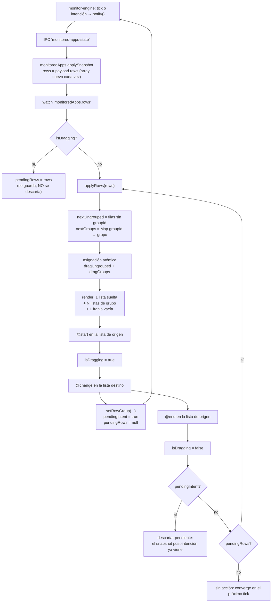
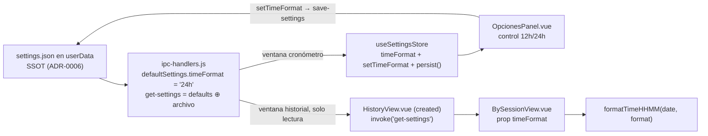

# Diseño técnico: work-groups-history-time-format

Todo el cambio vive en el renderer salvo dos líneas del main (`defaultSettings` y el merge de
lectura de `settings.json`). Ningún ítem toca el motor de monitoreo, la persistencia del
historial ni el modelo de grupos: ADR-0008 ya soporta N grupos, ADR-0007 ya define el
historial estructurado y ADR-0006 ya define cómo se persiste una preferencia.

## Mapa spec → decisión

| Spec | Decisión de diseño | Archivos |
|---|---|---|
| [[multiple-simultaneous-groups]] | **D-1**: colección `dragGroups` indexada por `groupId` + guarda única con snapshot diferido | `CronometroAplicacion.vue` |
| [[usage-aggregation-by-visible-app-name]] | **D-2**: `groupKeyOf` por nombre visible normalizado; rótulo por criterio F4; `appId` informativo → **ADR-0011** | `session-aggregate.js` |
| [[judgment-fixes-sessions-groups-history-revised]] | Sin código propio: sus tres requerimientos vigentes ya están implementados; el cuarto (F1) lo redefine D-2 | — |
| [[session-time-without-seconds]] + [[configurable-time-format-preference]] | **D-3**: `formatTimeHHMM(date, format)` pura + preferencia end-to-end por IPC pull → **ADR-0012** | `time-format.js`, `BySessionView.vue`, `HistoryView.vue`, `ipc-handlers.js`, `settings.js`, `OpcionesPanel.vue` |
| [[hide-usage-chart-duration-scale]] | **D-4a**: `scales.x.display: false` | `UsageChart.vue` |
| [[bright-chart-bars-on-dark-background]] | **D-4b**: `backgroundColor: '#d9d9d9'` | `UsageChart.vue` |
| [[readable-session-title-typography]] | **D-4c**: override local de `font-family` en `.app-name` / `.app-name-input` | `AppRow.vue` |

---

## D-1 — Ítem 1: N grupos simultáneos en el listado de trabajo

### Estado que se reemplaza

`CronometroAplicacion.vue` sostiene hoy **un** grupo: `activeGroupId` / `activeGroupName` en
`data()`, un array `dragGrouped`, un único `<div class="group-container">`, y un `watch` que
deriva `activeGroupId = grouped[0].groupId` — el primero que aparezca, ignorando que pueda
haber más (`CronometroAplicacion.vue:107-147`). `onGroupDragChange` asigna siempre a
`this.activeGroupId || this.generateGroupId()`: con un solo contenedor no hay ambigüedad sobre
a qué grupo va la fila, y por eso el límite es real aunque el modelo no lo imponga.

### Estructura de datos

Una **colección derivada** del snapshot, no una entidad nueva. ADR-0008 se mantiene íntegro:
un grupo existe si y solo si hay filas con ese `groupId`; nada se persiste ni se inventa en el
renderer.

```js
data() {
  return {
    dragUngrouped: [],      // filas sin groupId
    dragGroups: [],         // [{ groupId, groupName, rows: [] }] — un draggable por elemento
    dragNewGroup: [],       // SIEMPRE vacío: modelo de la franja de creación
    isDragging: false,      // guarda ÚNICA a nivel de componente
    pendingRows: null,      // snapshot llegado durante un arrastre, a aplicar al terminar
    pendingIntent: false,   // este gesto ya emitió una intención por IPC
    editingGroupId: null,   // reemplaza a editingGroupName (booleano)
    draftGroupName: '',
  }
}
```

Se eliminan `dragGrouped`, `activeGroupId`, `activeGroupName` y el computed
`showGroupContainer`.

**Orden de los grupos**: el de **primera aparición de cada `groupId` en `rows`**. `rows` del
motor conserva el orden de alta de las filas y `setRowGroup` muta la fila en su lugar sin
reordenar (`monitor-engine.js:380-397`), así que la posición de un grupo no salta al renombrar
ni en cada tick. Cambia solo si se detiene la fila que abría el grupo. Es determinista y
suficiente; no se agrega orden propio.

### Reconstrucción atómica

Una sola función, síncrona, sin `await`, que calcula todo en locales y **recién al final**
asigna. Vue agrupa las dos asignaciones en un único re-render.

```js
applyRows(rows) {
  const nextUngrouped = []
  const byId = new Map()
  const nextGroups = []
  rows.forEach((row) => {
    if (!row.groupId) { nextUngrouped.push(row); return }
    let group = byId.get(row.groupId)
    if (!group) {
      group = { groupId: row.groupId, groupName: row.groupName, rows: [] }
      byId.set(row.groupId, group)
      nextGroups.push(group)
    }
    group.rows.push(row)
  })
  this.dragUngrouped = nextUngrouped   // ── asignación atómica: nunca a medias
  this.dragGroups = nextGroups
}
```

Nunca se muta `dragGroups` in situ ni se reconstruye "grupo por grupo": una reconstrucción
parcial deja al `v-for` mostrando una mezcla de dos snapshots, y ese es exactamente el hueco
que R2 anticipa cuando los contenedores pasan de dos fijos a N.

### La guarda de arrastre (mitigación de R2)

Tres reglas, en orden de importancia:

**1. Una sola guarda, a nivel de componente — nunca una por lista.** Los N+2 `<draggable>`
(suelto, N grupos, franja) enlazan `@start`/`@end` al **mismo** `isDragging`. Es correcto
porque SortableJS emite `start` y `end` en la instancia **de origen** del gesto, exactamente
una vez cada uno: no hay anidamiento posible y la bandera no puede quedar trabada. Una guarda
por lista sí dejaría el hueco: el gesto toca dos listas y la lista destino no recibe `start`.

**2. El snapshot llegado durante el gesto se guarda, no se descarta.** Hoy el `watch` hace
`if (this.isDragging) return` y el snapshot se pierde; el estado converge recién con el tick
siguiente (≤1 s). Con N contenedores esa ventana es más cara: durante ese segundo la interfaz
puede mostrar una fila ya cerrada por el motor dentro de un grupo. El `watch` pasa a
`if (this.isDragging) { this.pendingRows = rows; return }` y `@end` aplica lo pendiente.

**3. Al terminar el gesto, si hubo intención, el snapshot pendiente se descarta.** `@change`
corre **antes** que `@end` (SortableJS despacha `onAdd`/`onRemove`/`onUpdate` dentro de
`_onDrop`, antes de `onEnd`), así que en `@end` ya se emitió `set-row-group` y el motor ya
llamó a `notify()`: hay un snapshot **más nuevo** en vuelo. Aplicar el pendiente —que es
anterior a la intención— devolvería la fila a su lista de origen por un frame antes de que
llegue el correcto: un parpadeo visible en **cada** agrupación. Por eso `@change` marca
`pendingIntent = true` y limpia `pendingRows`.

```js
onDragStart() { this.isDragging = true },
onDragEnd() {
  this.isDragging = false
  if (this.pendingIntent) { this.pendingIntent = false; return }  // llega uno más nuevo
  if (!this.pendingRows) return                                    // converge en el próximo tick
  const rows = this.pendingRows
  this.pendingRows = null
  this.$nextTick(() => this.applyRows(rows))   // fuera del despacho de eventos de SortableJS
}
```

El `$nextTick` es deliberado: re-renderizar dentro del propio handler de SortableJS destruye
nodos que la librería todavía puede tocar en lo que resta de `_onDrop`.

### Flujo completo



### Creación del segundo grupo

Decisión ya aprobada en `proposal.md` (franja permanente, sin botón). Su traducción técnica:

- La franja es un `<draggable v-model="dragNewGroup" group="monitored-rows">` con un array
  **siempre vacío**. Un `<div>` a secas no es zona de drop de SortableJS; tiene que ser una
  lista del mismo `group`.
- Al recibir su primera fila: `setRowGroup(appId, this.generateGroupId())` y
  `this.dragNewGroup = []` en el mismo handler. La fila vuelve en el próximo snapshot dentro
  de un grupo real; la franja nunca conserva contenido propio.
- Visibilidad: `dragUngrouped.length >= 1 || isDragging`.
  - `>= 1` es literal de la spec (*"mientras exista al menos una fila suelta"*). Cambia la
    heurística actual (`>= 2`): con una sola fila suelta la franja ahora aparece y permite
    formar un grupo de una fila. Costo aceptado: alto vertical y un grupo de un miembro, que
    es redundante con el nombre de sesión pero no dañino.
  - `|| isDragging` **no es cosmético**: al arrastrar la última fila suelta hacia un grupo, el
    listado suelto queda vacío en medio del gesto y la franja se desmontaría bajo el cursor,
    cambiando el alto de la ventana en pleno arrastre (ver R7). Ninguna lista se desmonta
    mientras hay un gesto en curso.
- La franja **no** necesita `@start`/`@end`: nunca puede originar un arrastre (está vacía) y
  esos eventos los emite la lista de origen.
- Desaparece el fallback `this.activeGroupId || this.generateGroupId()`: crear grupo es ahora
  responsabilidad exclusiva de la franja, y soltar en un grupo existente usa el `groupId` de
  ese grupo. Un solo camino por gesto.

### Cabecera y renombrado con N grupos

`editingGroupName` (booleano) pasa a `editingGroupId` (string|null); `startEditGroupName(group)`,
`confirmGroupName(group)` → `renameGroup(group.groupId, this.draftGroupName)`.

**Trampa de Vue 3 a documentar en el código**: un `ref` declarado dentro de un `v-for` se
registra como **array**, aunque un `v-if` deje un solo elemento renderizado. El focus pasa a:

```js
this.$nextTick(() => {
  const el = this.$refs.groupNameInput
  const input = Array.isArray(el) ? el[0] : el
  if (input) input.focus()
})
```

`renameGroup` en el motor ya escribe `groupName` en **todas** las filas del grupo y no toca
las de otros grupos (`monitor-engine.js:363-378`): la spec *"las acciones sobre un grupo no
alteran a los demás"* se cumple sin cambios en el main.

### Lo que NO cambia

`monitoredApps.js`, `monitor-engine.js`, `session-log.js`, `session-aggregate.js::buildDayTimeline`
y `BySessionView` ya soportan N grupos. El límite de 4 filas simultáneas
(`monitor-engine.js:114`) queda intacto: agrupar no crea ni destruye filas, y de ahí sale el
techo práctico de 4 grupos.

---

## D-2 — Ítem 3: la función de agrupación por aplicación

Decisión de arquitectura completa, con alternativas y trade-offs, en **ADR-0011**. Acá va solo
el contrato de implementación.

### Clave

```js
function normalizeAppName(app) {
  return String(app ?? '').trim().toLowerCase()
}
function groupKeyOf(entry) {
  return `name:${normalizeAppName(entry.app)}`
}
```

**Restricción dura**: la clave **nunca** vuelve a ser `appId` desnudo — eso revierte el fix F1.
El prefijo `name:` se conserva aunque ya no haya otra rama posible: es el formato que los
consumidores ya reciben y su ausencia no compra nada.

`String(entry.app ?? '')` blinda `app` nulo/ausente sin filtrar la entrada: un módulo puro que
descarta datos oculta el problema y borra tiempo registrado.

### Rótulo de la fila fusionada

Criterio de `installed-apps-filter.js:96-100` (fix F4), **verificado en el código antes de
citarlo**: gana el candidato de `name` más corto; ante empate de longitud se conserva el que ya
ganaba, es decir el de primera aparición.

Traducido a este agregador: gana el `entry.app` **crudo** más corto entre los miembros de la
clave; empate → se conserva el primero visto. Como la clave normaliza con `trim()`, los
miembros de una misma clave difieren solo en mayúsculas y en espacios de borde: el criterio
elige la variante sin espacio sobrante y, cuando no hay ninguna, se resuelve en la primera
aparición. **Es honesto decir que en este dominio el criterio degenera casi siempre en "primera
aparición"**; se lo adopta igual para que el proyecto tenga un solo criterio de rotulado y no
dos, y porque el caso no degenerado (variantes con espacios) sí produce mejor rótulo.

### `appId` de la fila fusionada

**Primer `appId` no nulo entre los miembros, o `null`. Informativo, nunca identificatorio.**
Verificado que ningún consumidor lo lee: `ByAppView.vue:10` usa `row.key` como clave del
`v-for` y `row.app` como texto; `UsageChart.vue:51,55` usan `app` y `durationMs`.

### Función completa

```js
function aggregateByApp(entries) {
  const totals = new Map()
  entries.forEach((entry) => {
    const key = groupKeyOf(entry)
    const existing = totals.get(key)
    if (!existing) {
      totals.set(key, {
        key,
        appId: entry.appId != null ? entry.appId : null,
        app: entry.app,
        durationMs: entry.durationMs,
      })
      return
    }
    existing.durationMs += entry.durationMs
    if (existing.appId == null && entry.appId != null) existing.appId = entry.appId
    if (String(entry.app ?? '').length < String(existing.app ?? '').length) existing.app = entry.app
  })
  return Array.from(totals.values()).sort((a, b) => b.durationMs - a.durationMs)
}
```

### Contrato del shape `{ key, appId, app, durationMs }`

Cambia la **semántica**, no la forma. Queda documentado en tres lugares y en ninguno más
(SSOT del criterio en el ADR, el resto apunta ahí):

| Campo | Contrato nuevo |
|---|---|
| `key` | `'name:' + nombre visible normalizado`. **Único por fila** y lo único identificatorio. Es lo que el `v-for` debe usar. |
| `appId` | Primer `appId` no nulo entre los miembros, o `null`. **Informativo**: no identifica la fila y no debe usarse como clave. |
| `app` | Rótulo elegido por el criterio F4 entre las variantes de escritura. |
| `durationMs` | Suma de las duraciones de todos los miembros de la clave. |

1. **ADR-0011** — la decisión, sus invariantes y sus alternativas descartadas.
2. **Comentario de cabecera de `groupKeyOf`/`aggregateByApp`** — reemplaza el párrafo que hoy
   explica la degradación por `appId`, que queda obsoleto y engañoso si se deja. Debe decir
   explícitamente que `appId` ya no es clave y por qué no puede volver a serlo.
3. **La spec** [[usage-aggregation-by-visible-app-name]] — ya emitida, con la supersesión de
   [[usage-chart-by-interval]] y el retiro de F1 en
   [[judgment-fixes-sessions-groups-history-revised]] ya aplicados.

### Verificación ya ejecutada en esta fase

Prototipo corrido con `node -e` contra las **44 entradas reales** de
`…/cronometro-apps/sessions.json` (2026-08-05):

| Control | Resultado |
|---|---|
| Negativo (clave actual) | 14 filas, con `Google Chrome`, `Firefox` y `League of Legends` **repetidos** |
| Positivo (clave nueva) | **11 filas**, sin rótulos repetidos |
| Suma de `durationMs` preservada | **sí** (idéntica antes y después) |
| `key` única por fila | **sí** (11 claves para 11 filas) |
| `Chrome` y `Google Chrome` separados | **sí** — ningún programa distinto se fusiona |
| Borde `app: "null"` (string) | sobrevive como fila propia `name:null`, 1 entrada — declarado fuera de alcance |
| Borde `app` nulo/ausente (JS) | colapsa en `name:` con rótulo vacío; **no existe en los datos reales** |

---

## D-3 — Ítems 5+6: hora sin segundos y preferencia 12h/24h

Una sola unidad de trabajo: ambos ítems tocan el mismo punto de formateo.

### `formatTimeHHMM(dateObj, format)` — contrato exacto

`src/utils/time-format.js` es un módulo **puro y CommonJS por convención declarada en su propia
cabecera**, verificable con `node -e` sin webpack ni Babel. El formato entra **como parámetro
explícito**; la función no lee el store ni ningún estado global. Esto no es preferencia de
estilo: es la propiedad que hace verificable al módulo, y romperla acopla una utilidad a una
UI.

```js
function formatTimeHHMM(dateObj, format) {
  const h24 = dateObj.getHours()
  const mm = String(dateObj.getMinutes()).padStart(2, '0')
  if (format === '12h') {
    const h12 = h24 % 12 === 0 ? 12 : h24 % 12
    return `${h12}:${mm} ${h24 < 12 ? 'AM' : 'PM'}`
  }
  return `${String(h24).padStart(2, '0')}:${mm}`
}
```

| Aspecto | Contrato |
|---|---|
| Parámetros | `dateObj: Date` (hora local, `getHours`/`getMinutes` — nunca UTC), `format: string` |
| Salida 24h | `HH:MM` con cero a la izquierda (`00:05`, `13:05`) |
| Salida 12h | `H:MM AM|PM` **sin** cero a la izquierda (`9:05 AM`, `1:05 PM`) — convención de reloj de 12 horas y diferencia visible entre formatos |
| Medianoche / mediodía | `00:05` → `12:05 AM`; `12:00` → `12:00 PM` |
| Función total | 12h **si y solo si** `format === '12h'`; cualquier otro valor, incluido `undefined`, produce 24h. Nunca lanza |
| Relación con el default del producto | El default de producto vive **solo** en `defaultSettings.timeFormat` (main). La rama 24h de la función es la definición total de la función, no una segunda fuente de verdad de la preferencia |

**Valores ya verificados con `node -e` en esta fase**: `00:05 / 12:05 AM`, `09:05 / 9:05 AM`,
`12:00 / 12:00 PM`, `13:05 / 1:05 PM`, `23:59 / 11:59 PM`, y `undefined → 24h`.

### `formatTimeHHMMSS` se retira

Grep exhaustivo sobre `src/`: su **único** llamador es `BySessionView.vue:53` (vía
`formatRange`), que pasa a `formatTimeHHMM`. Se elimina la función y su entrada en
`module.exports`. Dejarla es código muerto con un nombre que invita a usarla y a saltarse la
preferencia. **`msToHHMMSS` es otra función** (duraciones, 5 consumidores) y no se toca; el
tercer export, `formatDateYYYYMMDD`, tampoco.

Criterio de completado para `sdd-apply`: `grep -rn "formatTimeHHMMSS" src/` devuelve 0 líneas.

### Preferencia end-to-end

Decisión de arquitectura sobre cómo llega la preferencia a la ventana de historial en
**ADR-0012**. Resumen del flujo:



**Cuatro puntos de implementación, tres de ellos son defectos latentes si se omiten:**

1. **`defaultSettings` (`ipc-handlers.js:18`)** →
   `{ masterVolume: 1, interactionVolume: 1, timeFormat: '24h' }`.
   `'24h'` es el default porque es exactamente lo que la app muestra hoy: un usuario que no
   toca nada no ve ningún cambio de formato, solo la pérdida de los segundos.

2. **El default tiene que aplicarse también a un archivo ya existente.**
   `readJson(path, defaultSettings)` devuelve el `fallback` **solo si el archivo falta o está
   corrupto**. El `settings.json` real del usuario existe y tiene únicamente
   `{ masterVolume, interactionVolume }` (verificado en esta fase): sin merge, `timeFormat`
   llega `undefined` al renderer. El handler pasa a:

   ```js
   ipcMain.handle('get-settings', () => ({
     ...defaultSettings,
     ...jsonStore.readJson(getSettingsFilePath(), {}),
   }))
   ```

   `defaultSettings` sigue siendo el único lugar donde vive un default, ahora para los dos
   casos (archivo ausente y archivo sin la clave).

3. **El store no puede seguir enumerando el payload en cada setter.** `setMaster` y
   `setInteraction` envían hoy un literal `{ masterVolume, interactionVolume }`: agregar
   `timeFormat` al estado sin tocarlos hace que **mover el volumen borre la preferencia del
   disco**. Se centraliza en un único `persist()` que los tres setters llaman:

   ```js
   state: () => ({ masterVolume: 1, interactionVolume: 1, timeFormat: '24h' }),
   actions: {
     persist() {
       ipcRenderer.send('save-settings', {
         masterVolume: this.masterVolume,
         interactionVolume: this.interactionVolume,
         timeFormat: this.timeFormat,
       })
     },
     setTimeFormat(v) { this.timeFormat = v; this.persist() },
     // setMaster / setInteraction: misma lógica de audio, pero terminan en this.persist()
   }
   ```

   `load()` agrega `this.timeFormat = settings.timeFormat` sin fallback propio: el main ya
   entregó el default (punto 2), y repetirlo acá crearía una segunda fuente de verdad.

4. **`BySessionView` recibe el formato por prop, no lo busca.**
   `props: { entries, timeFormat: { type: String, default: '24h' } }`, y
   `formatRange(entry)` pasa `this.timeFormat` a las dos llamadas. `HistoryView.vue` —único
   punto de IPC de esa ventana (D-10)— lo carga en `created()` con el `get-settings` que ya
   existe y lo baja como `:time-format="timeFormat"`. La ventana de historial **no monta Pinia**
   y no debe importar `@/stores/settings`: ese import arrastra `@/plugins/sound`, que precarga
   cinco `Howl` en el tope del módulo (ADR-0012).

**Limitación aceptada y declarada**: la preferencia se lee al abrir la ventana de historial.
`background.js:186-210` crea una `BrowserWindow` nueva en cada apertura, así que cada apertura
toma el valor vigente; una ventana **ya abierta** conserva el formato anterior hasta reabrirla.
Es una lectura menos estricta del escenario *"a partir de ese momento"* de
[[configurable-time-format-preference]]. La mitigación exacta (canal push `settings-updated`)
está evaluada y descartada en ADR-0012, con su costo escrito por si el usuario objeta.

### Control de UI en `OpcionesPanel.vue`

`<select>` con dos opciones cuyos **`value` son `'24h'` y `'12h'`**: el mismo dominio que el
parámetro de `formatTimeHHMM`, sin capa de mapeo entre la UI y la función. Se agrega como
bloque `.setting-control` y las tres reglas CSS existentes de `.volume-control` pasan a listar
ambos selectores: reusar la clase `.volume-control` para una preferencia que no es de volumen
sería un nombre mentiroso por ahorrar dos líneas.

---

## D-4 — Ítems 2, 4 y 7: ajustes acotados

Los tres son de una a tres líneas, pero cada uno tiene un detalle que decide si sale bien a la
primera.

### D-4a — Ocultar la escala de duración (`UsageChart.vue`)

```js
scales: {
  x: { display: false },
  y: { grid: { display: false } },
}
```

`display: false` oculta la escala **entera** (línea, grilla y ticks) — es la opción documentada
por chart.js 4 para eso (ver `tech-context.md`). En consecuencia `scales.x.grid` y
`scales.x.ticks.callback` quedan sin efecto y **se retiran**: dejarlos es configuración muerta
que sugiere que hace algo. `scales.y` no se toca (los nombres de aplicación siguen visibles) y
el `tooltip.callbacks.label` tampoco: el valor exacto sigue disponible al pasar el mouse, que
es lo que la spec exige. El import de `msToHHMMSS` **sigue usándose** por el tooltip: no queda
import huérfano.

### D-4b — Barras más claras (`UsageChart.vue`)

`backgroundColor: '#6f6f6f'` → `'#d9d9d9'`. Contraste ≈ **12:1** contra el fondo `#1b1b1b` de
la ventana (contra ≈ 2,9:1 del gris actual). Se elige un gris claro y no blanco puro para
evitar deslumbre en una ventana enteramente oscura; es un parámetro de gusto y cambiarlo
después cuesta un carácter.

**No** se toca `ChartJS.defaults.color` (`#f0f0f0`): las etiquetas de categoría se dibujan
sobre el fondo de la ventana, no sobre las barras, así que el color nuevo de barra no les
quita contraste. **No** se toca ningún color de fondo: `dark-loading-state` sigue intacta.

### D-4c — Tipografía del título de sesión (`AppRow.vue`)

`font-family: sans-serif` en `.app-name` y `.app-name-input`. Es la misma familia genérica que
la ventana de historial ya usa; no se agrega ninguna fuente ni ningún `@import`.

Alcance verificado en el código: `.app-name` y `.app-name-input` son el **mismo texto** en sus
dos estados (`displayName() { return this.row.sessionName || this.row.name }`,
`AppRow.vue:90-92`), así que no son separables por CSS y no hace falta que lo sean: el
resultado deseado es que ese texto se lea bien tenga nombre de sesión o no. `App.vue` y
`CronometroPomodoro.vue` **no se tocan**: el resto de la ventana conserva la decorativa por
decisión explícita del usuario (Q1).

**Detalle de orden que decide el resultado**: `.app-name-input` declara `font: inherit`, y el
shorthand `font` **resetea `font-family`**. El `font-family: sans-serif` tiene que ir
**después** de `font: inherit` dentro de la misma regla, o no aplica.

**Efecto visual esperado, a confirmar**: `.app-name` y `.app-name-input` tienen `width: 8ch`, y
`ch` depende de la fuente — el ancho renderizado del nombre cambia al cambiar de familia. No es
un defecto, pero es lo primero que hay que mirar en la verificación visual.

---

## Decisiones registradas como ADR

| ADR | Decisión | Por qué no la cubría ninguno vigente |
|---|---|---|
| **ADR-0011** — identidad de aplicación por nombre visible normalizado | D-2 | Ningún ADR fija el criterio de identidad de la agregación: vivía como fix de spec (F1). Esta decisión redefine el contrato de un módulo puro compartido por dos vistas y **contradice el criterio documentado** en la nota F1 y en `usage-chart-by-interval`. ADR-0007 decide el formato y la migración, no la agregación: **no se supersede** |
| **ADR-0012** — la ventana de historial lee preferencias por IPC, sin Pinia | D-3 punto 4 | ADR-0010 confina el gráfico para proteger la ventana del cronómetro; la dirección inversa (qué del bundle principal se filtra al historial) no estaba cubierta. Constriñe a toda preferencia futura de esa ventana. Se marca `amends: ADR-0010` por continuidad de criterio, sin supersederlo |

**No se crean ADRs** para: la extensión de `settings.json` con una clave (aplicación directa de
ADR-0006), el uso de N `<draggable>` (ADR-0008 ya declara que el modelo soporta N grupos y que
el límite era de UI), ni los tres ajustes visuales (parámetros, no decisiones).

---

## Estrategia de verificación sin test runner

El proyecto **no tiene runner ni CI** y, en este worktree, tampoco `node_modules` (verificado).
Eso parte la verificación en tres franjas con fronteras nítidas. `sdd-tasks` debe asignar a cada
tarea la franja que le corresponde.

### Franja A — verificable ahora, con `node -e`, sin instalar nada

Alcanza a los **dos módulos puros CommonJS** y solo a ellos: `session-aggregate.js` y
`time-format.js`. No dependen de Electron, Pinia, Vue ni webpack. Node v24 está disponible y el
`sessions.json` real del usuario es legible por interop
(`/mnt/c/Users/Luis Araya/AppData/Roaming/cronometro-apps/sessions.json`, 44 entradas). Es el
mismo procedimiento que sustentó el fix F1.

| Spec | Aserción ejecutable |
|---|---|
| [[usage-aggregation-by-visible-app-name]] | Control **negativo** (clave actual) → 14 filas con 3 rótulos repetidos. Control **positivo** (clave nueva) → 11 filas, ningún rótulo repetido |
| ídem | `Σ durationMs` de entrada **igual** a `Σ durationMs` de salida (no se pierde ni se duplica tiempo) |
| ídem | `new Set(rows.map(r => r.key)).size === rows.length` (la clave del `v-for` es única) |
| ídem | Existen simultáneamente `name:chrome` y `name:google chrome` (no se fusionan nombres distintos) |
| ídem | Fabricado: dos entradas con `app` `'Chrome '` y `'Chrome'` → 1 fila rotulada `'Chrome'` (criterio F4) |
| [[session-time-without-seconds]] | `formatTimeHHMM(new Date(2026,0,1,13,5), '24h') === '13:05'` — sin segundos, con cero a la izquierda |
| [[configurable-time-format-preference]] | `'12h'` → `'1:05 PM'`; medianoche → `'12:05 AM'`; mediodía → `'12:00 PM'`; `undefined` → `'13:05'` |

Los siete controles **ya corrieron sobre un prototipo** en esta fase y pasaron. En `sdd-verify`
se repiten contra el código real, no contra el prototipo.

### Franja B — exige `npm install` + `electron:serve`, hoy no disponible

Todo lo que vive en `.vue`: ítems 1, 2, 4, 7 y la cadena end-to-end del 6. `node_modules` no
existe en el worktree y una sesión previa registró una instalación fallida, así que **levantar
la app es una precondición, no un paso**. `npm run lint` (ESLint 7 + eslint-plugin-vue 8) cae
en la misma franja y hay que correrlo una vez que la instalación prospere: el refactor de D-1
es el cambio de template más grande del lote.

Dentro de esta franja hay un control **barato y de alto valor** que no requiere mirar la UI:
después de cambiar el formato en el panel, abrir `settings.json` en `userData` y comprobar que
conserva **las tres** claves. Es la prueba directa de que `persist()` no pisa la preferencia al
mover el volumen, que es el defecto latente más probable de D-3.

### Franja C — exige observación humana con mouse sobre DOM renderizado

No hay forma de automatizarla en este proyecto, y la spec [[group-composition-and-drag]] ya lo
deja registrado. Son los cuatro gestos de [[multiple-simultaneous-groups]], más las tres
comprobaciones visuales:

| # | Qué se observa | Spec |
|---|---|---|
| C1 | Arrastrar una fila suelta a la franja con un grupo ya formado → aparece el **segundo** grupo y el primero sigue igual | multiple-simultaneous-groups |
| C2 | Con dos grupos formados y una fila suelta, **sigue habiendo franja** disponible | ídem |
| C3 | Mover una fila del grupo A al grupo B con un tercer grupo presente → **el tercero no cambia** | ídem |
| C4 | Vaciar un grupo → desaparece **solo ese** grupo | ídem |
| C5 | Renombrar el grupo B no altera el nombre de A ni de C | ídem |
| C6 | El eje de números al pie del gráfico ya no está; el tooltip sigue mostrando el valor | hide-usage-chart-duration-scale |
| C7 | Barras claras sobre fondo oscuro, fondo de ventana sin cambios | bright-chart-bars-on-dark-background |
| C8 | Nombre/título de sesión legible; título "Work" y Pomodoro **siguen decorativos** | readable-session-title-typography |

**Frontera explícita**: ninguna de estas ocho es verificable con `node -e`, y ninguna de las de
la Franja A necesita la app corriendo. Un veredicto de `sdd-verify` que dependa solo de la
Franja A cubre exactamente dos de las ocho specs (las de los ítems 3 y 5+6, y del 6 solo la
función de formateo, no la persistencia).

### [[judgment-fixes-sessions-groups-history-revised]]

No introduce código en este cambio: sus tres requerimientos vigentes (cierre definitivo al
salir, escritura atómica del historial, nombre principal en instaladas) ya están implementados
y verificados. Lo único que le corresponde acá es **no romperlos**: D-2 toca
`session-aggregate.js`, que no participa de ninguno de los tres. Verificación: revisión de
diff, sin ejecución.

---

## Riesgos de diseño

| # | Riesgo | Prob./Imp. | Mitigación en el diseño |
|---|---|---|---|
| R2 | Regresión de arrastre al pasar de dos listas fijas a N | Media / Alto | Guarda única a nivel de componente, snapshot diferido en vez de descartado, reconstrucción atómica, ninguna lista se desmonta durante el gesto. Verificación C1-C5 |
| R4 | La unificación por nombre fusiona programas distintos | Media / Alto | La clave nunca es `appId` desnudo, la normalización es solo `trim`+`toLowerCase` (sin alias ni heurística), controles negativo y positivo sobre datos reales. ADR-0011 fija la invariante |
| R6 | `Chrome` y `Google Chrome` siguen en dos barras | Media / Bajo | Fuera de alcance declarado, con las tres alternativas evaluadas en ADR-0011 |
| R7 | **Nuevo**: el `ResizeObserver` de `Menu.vue` redimensiona la ventana ante cada cambio de alto del contenido (`setContentSize`, D13). Con N contenedores y una franja permanente el alto cambia más seguido, incluso **durante** un arrastre (SortableJS inserta un placeholder), lo que puede mover la ventana bajo el cursor | Media / Medio | La franja no se desmonta mientras `isDragging`, que elimina el cambio de alto más probable del gesto. El resto queda observado en C1-C5. Suprimir el resize durante el arrastre exigiría que `Menu.vue` conozca el estado de arrastre de un hijo: fuera de alcance |
| R8 | **Nuevo**: la preferencia no se aplica en vivo a una ventana de historial ya abierta | Media / Bajo | Declarado en ADR-0012 con la mitigación exacta lista si el usuario objeta |
| R1 | Los ítems visuales se entregan sin haber corrido el código modificado | Media / Bajo | Franja B/C de la estrategia de verificación; los tres ajustes son de una a tres líneas |

---

## Output Expected

Diez archivos, todos `MODIFY`. **Ningún archivo nuevo de código**; ningún cambio en
`monitor-engine.js`, `session-log.js`, `monitoredApps.js`, `background.js`, `App.vue`,
`CronometroPomodoro.vue`, `vue.config.js` ni `package.json`.

| # | Archivo | Ítem / Spec | Cambio |
|---|---|---|---|
| 1 | `src/components/CronometroAplicacion.vue` | 1 / multiple-simultaneous-groups | `data()`: `dragGroups`/`dragNewGroup`/`pendingRows`/`pendingIntent`/`editingGroupId`; se eliminan `dragGrouped`, `activeGroupId`, `activeGroupName`, `showGroupContainer`. Método `applyRows()` atómico; `watch` con snapshot diferido; `onDragStart`/`onDragEnd` con la guarda de tres reglas. Template: `v-for` de N contenedores + franja `<draggable>` siempre vacía. Cabecera y renombrado por grupo (con el ref-en-`v-for` como array). CSS: `min-height` en la lista vacía de la franja |
| 2 | `src/utils/session-aggregate.js` | 3 / usage-aggregation-by-visible-app-name | `normalizeAppName` + `groupKeyOf` por nombre visible; `aggregateByApp` con rótulo F4 y `appId` informativo. Comentario de cabecera reescrito (el actual explica la degradación por `appId` y queda obsoleto) |
| 3 | `src/utils/time-format.js` | 5+6 / session-time-without-seconds, configurable-time-format-preference | `+ formatTimeHHMM(dateObj, format)`; **se elimina** `formatTimeHHMMSS` y su export. `msToHHMMSS` y `formatDateYYYYMMDD` intactas |
| 4 | `src/history/BySessionView.vue` | 5+6 | Prop `timeFormat` (default `'24h'`); `formatRange` usa `formatTimeHHMM(date, this.timeFormat)`; import actualizado |
| 5 | `src/history/HistoryView.vue` | 6 | `timeFormat` en `data()`, carga en `created()` con `invoke('get-settings')`, y `:time-format` a `BySessionView`. **No** se importa el store ni se monta Pinia |
| 6 | `src/main/ipc-handlers.js` | 6 | `defaultSettings.timeFormat = '24h'` y merge de defaults en el handler `get-settings` |
| 7 | `src/stores/settings.js` | 6 | Estado `timeFormat`, acción `setTimeFormat`, y `persist()` único que reemplaza los dos payloads literales de `setMaster`/`setInteraction`; `load()` lee `timeFormat` |
| 8 | `src/components/OpcionesPanel.vue` | 6 | Bloque `.setting-control` con `<select>` de valores `'24h'`/`'12h'` enlazado a `setTimeFormat`; las tres reglas CSS de `.volume-control` pasan a listar ambos selectores |
| 9 | `src/history/UsageChart.vue` | 2 + 7 | `scales.x` → `{ display: false }` (se retiran `grid` y `ticks.callback`); `backgroundColor` → `'#d9d9d9'`. No se tocan `ChartJS.defaults`, el tooltip, ni el `@import` de la fuente |
| 10 | `src/components/AppRow.vue` | 4 / readable-session-title-typography | `font-family: sans-serif` en `.app-name` y en `.app-name-input` (en esta última, **después** de `font: inherit`) |

**Artefactos de memoria ya producidos por esta fase** (no los reproduce `sdd-apply`):
`memory/adrs/0011-app-identity-by-normalized-visible-name.md`,
`memory/adrs/0012-history-window-reads-preferences-over-ipc-without-pinia.md`,
`memory/changes/work-groups-history-time-format/tech-context.md`.

### Orden sugerido para `sdd-tasks`

1. **Módulos puros primero** (archivos 2 y 3): son los únicos verificables hoy y no dependen de
   nada más. El archivo 3 debe completarse **antes** que el 4, o `BySessionView` queda roto.
2. **Cadena de la preferencia** (6 → 7 → 8 → 4 → 5): de la fuente de verdad hacia los
   consumidores, para que cada paso sea observable en el siguiente.
3. **Ajustes visuales** (9 y 10): independientes entre sí y del resto.
4. **Refactor de N grupos** (archivo 1) al final: es el único cambio grande y el único cuya
   verificación exige la app corriendo con mouse real; no bloquea a ningún otro.
